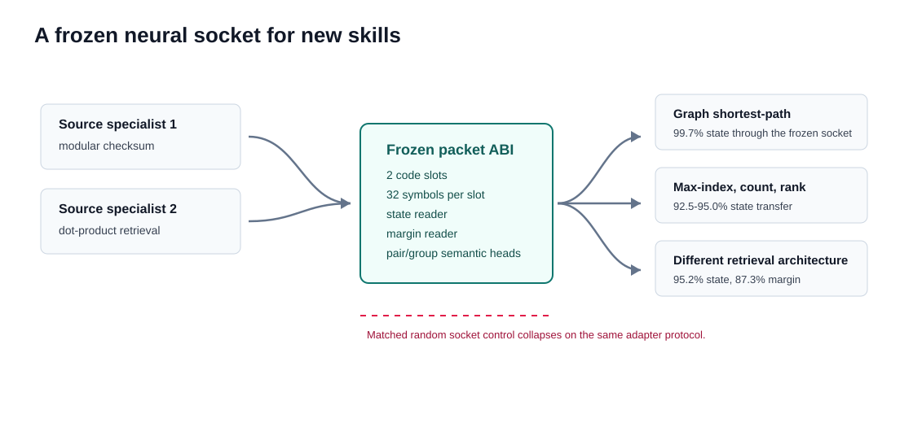
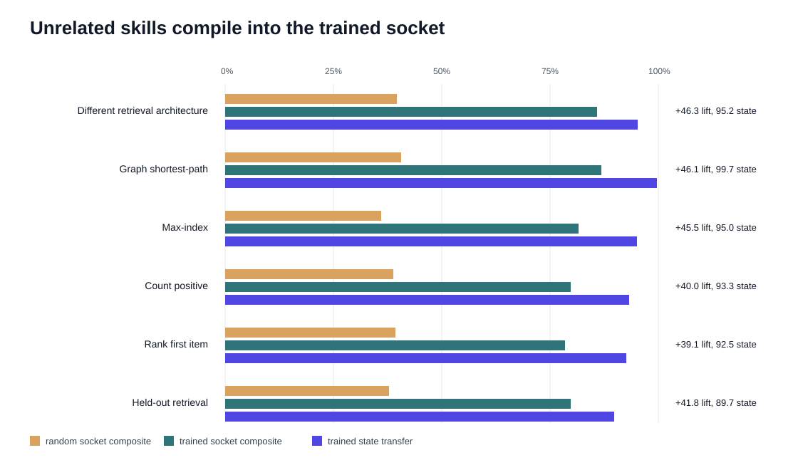

# Abstract

Modern AI systems are starting to look less like single monoliths and more like collections of specialists: a retriever here, a verifier there, a ranker, a planner, a graph solver, a calculator. The awkward part is that the usual interfaces are still human-shaped. We make neural components talk through text, JSON, labels, logits, or raw hidden states, even when the receiver is another neural component.

This paper tests a small alternative: a frozen neural socket. The socket is trained once from two source specialist families, modular checksum and dot-product retrieval. Then the socket stops learning. New neural skills can only train local encoders into the frozen packet ABI. The packet is tiny: two code slots, each choosing one of 32 symbols. The socket's frozen readers interpret packets as a typed state and a task-local auxiliary/separation bucket.

The surprising part is not that held-out retrieval still works. The surprising part is that held-out synthetic skills outside the source families work. A graph shortest-path specialist plugs into the frozen socket at 99.7% state and 99.6% auxiliary transfer. A max-index specialist reaches 95.0% state transfer. Counting positive entries reaches 93.3%. Ranking the first item reaches 92.5%. These skills were not source domains for the socket.

A matched random socket does not explain the result. Across held-out skills outside the source families, the trained socket beats the random socket by 43.4 percentage points on the composite transfer score. The random control sees the same specialists, the same local adapter protocol, and the same packet size. It lacks only source-trained socket semantics.

The claim is deliberately scoped: a small frozen typed ABI can act as a reusable socket for neural specialists. This is not zero-shot sender learning; it is frozen-socket transfer after local compilation. New skills do not need to retrain the socket. They compile into it.

# 1. Introduction

Software got powerful when components stopped needing to know each other's insides. A program can call a file system, a graphics driver, or a network stack because there is an interface in the middle. The interface is not the whole computation. It is the contract.

Neural systems mostly do not have that object yet.

When we connect models today, we usually pick one of four awkward options. Text is flexible but bulky and lossy. JSON is cleaner, but still a human-facing serialization. Logits and labels are narrow. Hidden states are rich, but private to one model's coordinate system. None of these quite feels like a native socket for neural skills.

This paper asks a blunt question:

Can a small frozen neural interface behave like a reusable socket for unrelated skills?

The setup is intentionally concrete. We train a packet ABI on two source specialist families:

- modular checksum specialists
- dot-product retrieval specialists

The ABI learns to encode each specialist's hidden features into two discrete packet slots. Frozen readers attach typed meaning to the packet:

- a state/class
- a task-local auxiliary/separation bucket

Then we freeze the ABI. No more socket learning.

Now come the new skills. They are allowed to train only local encoders into the frozen socket. The socket readers do not move. The source-trained semantic heads do not move. If a new skill works, it is because the specialist learned to compile its private computation into an existing packet contract.

The held-out skills are deliberately not all cosmetic variants of the source tasks:

| skill | input shape | state meaning | auxiliary/separation meaning |
|---|---|---|---|
| held-out retrieval | query and candidates | winning candidate bucket | top1/top2 score gap |
| different retrieval architecture | query and candidates | winning candidate bucket | top1/top2 score gap |
| max-index | real-valued list | largest slot | top1/top2 value gap |
| count-positive | real-valued list | number above zero | closest item to the decision boundary |
| rank-first | real-valued list | rank of first item | nearest neighboring-rank gap |
| graph shortest-path | graph adjacency matrix | path-length bucket | graph density bucket |

The graph row is the cleanest intuitive hook. A tiny socket trained on checksum and retrieval can later accept a specialist that reasons over paths in a graph.

That should not be assumed. A frozen random socket is also a fixed interface. A strong enough local encoder might bend itself into random labels. So we run a matched random-socket control: same packet size, same specialists, same adapters, same evaluation, but no source-trained ABI semantics.

It does not close the gap. The trained socket wins broadly.

{ width=100% }

## 1.1 Contributions

- We test a frozen typed packet ABI into which later specialists train only local encoders.
- We evaluate transfer to held-out synthetic skills outside the source families, including graph shortest-path, max-index, counting, and ranking.
- We compare against a matched random-socket control, not only shuffled-packet controls.
- We show broad trained-over-random lift across held-out skills outside the source families: 43.4 percentage points on the mean composite score.
- We argue for a narrow but vivid claim: small neural specialists can compile into a frozen typed socket without sharing architecture, task family, or weights.

# 2. The Frozen Socket Test

The packet ABI has two slots. Each slot chooses one of 32 symbols. The whole message is therefore a tiny discrete object, but it is not treated as a raw class label. The ABI has frozen readers:

- a state reader
- an auxiliary/separation reader
- downstream semantic heads trained on source packets for pair and group relations

The state is the task's discrete answer bucket. The auxiliary/separation field is a task-local attribute that behaves like a margin when the task has a natural confidence gap. In retrieval it is the top1/top2 gap. In max-index it is the gap between the largest and second-largest values. In count-positive it is the smallest absolute value, meaning the distance to the nearest sign flip. In rank-first it is the distance from the first item to its nearest rank neighbor. In graph shortest-path it is not a confidence margin; it is graph density, a typed auxiliary attribute that gives the packet a second semantic coordinate.

This typed contract is the entire trick. The socket is not asked to carry arbitrary thought. It is asked to carry "what state is this, and what task-local auxiliary/separation attribute goes with it?"

Training has three phases:

1. Train source and held-out specialists on their own tasks.
2. Train the packet ABI on source specialists only, then freeze it.
3. Train local encoders for held-out skills into the frozen ABI.

Evaluation then reads held-out packets using the frozen readers and source-trained semantic heads. We report:

- **state transfer:** frozen state reader accuracy on held-out skill packets
- **auxiliary transfer:** frozen auxiliary reader accuracy
- **pair transfer:** a source-trained four-way relation over two packets
- **group transfer:** a source-trained group/ranking relation over four packets

The composite score is the unweighted mean of state, auxiliary, pair, and group transfer:

$$
\mathrm{composite} = (\mathrm{state} + \mathrm{auxiliary} + \mathrm{pair} + \mathrm{group}) / 4.
$$

For each skill, we also evaluate shuffled packets. Shuffling preserves the broad evaluation distribution while breaking symbol identity. These shuffled rows are empirical distribution-breaking controls, not estimates of uniform random guessing; because frozen readers can become confidently wrong after symbol identity is broken, they can fall below nominal chance. More importantly, we run a matched random-socket control: the ABI is randomly initialized and frozen, including its state and auxiliary readers, then the same local encoder protocol is used. Nominal chance levels are 12.5% for state, 16.7% for auxiliary, 25% for pair, and 25% for group. The random-socket control is the stronger baseline because it captures what a flexible local adapter can do without a learned socket contract.

# 3. Method Details

All runs use controlled synthetic tasks with `24,576` train examples, `6,144` validation examples, and `6,144` test examples per task split. The source socket is trained from four checksum senders and four dot-product retrieval senders. Each held-out domain uses two held-out specialists. The aggregate report contains three trained-socket seeds and three matched random-socket controls using the same run configurations. No failed runs are filtered out of the aggregate table.

Specialists are small MLP-style task networks. Checksum specialists use learned embeddings of modular inputs with width `144`. Retrieval, max-index, count-positive, rank-first, and graph-path specialists use task-specific feature maps followed by two hidden layers of width `144`; each specialist has separate state and auxiliary heads. Specialists are trained with AdamW at learning rate `1e-3` and cross-entropy losses for state and auxiliary labels.

The packet ABI encoder maps task features through a `176`-wide GELU hidden layer into `64` logits, then reshapes those logits as two `32`-way code slots. Discretization uses straight-through hard one-hot codes during training and hard argmax codes at evaluation. The ABI's state and auxiliary readers are one-hidden-layer MLPs over the flattened `64`-dimensional packet. ABI training uses AdamW at learning rate `1e-3` for `96` epochs over an `8,192`-row source budget, selecting the checkpoint with the best mean source validation state/auxiliary accuracy.

Held-out specialists do not update the socket. Each held-out specialist trains only a local encoder with the same encoder shape into the frozen state and auxiliary readers. The adapter budget is `2,048` examples, trained for `72` epochs with AdamW at learning rate `1e-3`. The adapter loss is state cross-entropy plus auxiliary cross-entropy through the frozen readers, with slot-local anchoring terms and a small code-usage entropy reward. Pair and group heads are not used to train adapters. They are trained afterward on source packet semantics only and then evaluated on held-out packet semantics.

The matched random socket is a newly initialized `2x32` ABI whose encoder and readers are frozen without source training. Held-out adapters are trained into that frozen random target using the same budgets, losses, and evaluation code. This control keeps the adapter capacity and packet size fixed while removing the source-trained packet semantics.

# 4. Results

The headline result is broad and easy to read. The trained socket is not merely better on the source-like rows. It beats the random socket on every held-out skill, including the visually different ones.

{ width=100% }

The aggregate result over held-out skills outside the source families is:

| headline | value |
|---|---:|
| mean held-out lift over random socket | 43.4% |
| mean held-out state transfer | 95.1% |
| mean held-out pair transfer | 76.1% |

The per-skill ranking is:

| skill | trained composite | random composite | lift | state |
|---|---:|---:|---:|---:|
| retrieval-arch | 85.9% | 39.6% | 46.3% | 95.2% |
| graph-path | 86.9% | 40.7% | 46.1% | 99.7% |
| max-index | 81.5% | 36.0% | 45.5% | 95.0% |
| retrieval | 79.8% | 37.9% | 41.8% | 89.7% |
| count-positive | 78.8% | 38.8% | 40.0% | 93.3% |
| rank-first | 78.4% | 39.2% | 39.1% | 92.5% |
| checksum | 51.6% | 30.1% | 21.5% | 41.9% |

The checksum row is weakest. It is included as a held-out source-family sanity check, while the headline claim is outside-source-family transfer. That weaker row is useful, because it keeps the story honest. This is not "everything becomes perfect." The surprising result is that the outside-source-family rows are stronger than the obvious held-out checksum row.

Graph shortest-path is the best example. The specialist sees a graph adjacency matrix and predicts a path-length bucket. The frozen socket was trained on modular checksum and dot-product retrieval. Still, after local compilation, the frozen state reader reaches 99.7% and the frozen auxiliary reader reaches 99.6%. The random socket's composite score is 40.7%, while the trained socket reaches 86.9%.

Max-index gives a second simple picture. The input is a real-valued list, and the state is the largest slot. The trained socket reaches 95.0% state transfer and 81.5% composite transfer. The random socket's composite is 36.0%.

Counting and ranking also work. Count-positive reaches 93.3% state transfer. Rank-first reaches 92.5%. These are small algorithmic skills, but they are different enough to make the socket story vivid: the interface is carrying a typed answer, not memorizing one input format.

## 4.1 Full Transfer Table

The next tables report mean transfer across the three trained-socket runs. Bracketed ranges in the underlying report are tight for most non-source-family rows; the seed-variance table below gives standard deviations directly.

| skill | state | auxiliary | pair | group |
|---|---:|---:|---:|---:|
| checksum | 41.9% | 53.5% | 43.2% | 67.9% |
| retrieval | 89.7% | 78.8% | 73.1% | 77.3% |
| retrieval-arch | 95.2% | 87.3% | 80.0% | 81.1% |
| max-index | 95.0% | 68.1% | 81.3% | 81.6% |
| count-positive | 93.3% | 83.0% | 71.6% | 67.3% |
| rank-first | 92.5% | 77.7% | 73.5% | 69.7% |
| graph-path | 99.7% | 99.6% | 74.0% | 74.2% |

Shuffled-packet controls for the same trained-socket runs:

| skill | state shuffled | auxiliary shuffled | pair shuffled | group shuffled |
|---|---:|---:|---:|---:|
| checksum | 8.0% | 15.6% | 36.0% | 53.2% |
| retrieval | 4.0% | 13.7% | 42.4% | 45.1% |
| retrieval-arch | 1.8% | 10.2% | 47.8% | 54.7% |
| max-index | 3.2% | 16.3% | 41.9% | 37.8% |
| count-positive | 3.6% | 10.7% | 38.1% | 42.5% |
| rank-first | 3.6% | 11.5% | 47.9% | 46.0% |
| graph-path | 0.1% | 1.3% | 58.1% | 45.0% |

# 5. Controls

The random control is the difference between a paper and a demo.

Without it, one could argue that local encoders are just powerful. Maybe any frozen decoder can be targeted if the adapter trains long enough. The random-socket control keeps that possibility alive and tests it directly.

The answer is clear but not cartoonish. Random sockets learn partial structure on some state rows, especially max-index and graph-path. They do not recover the trained socket's reusable semantics. They sit around 36-41% composite on the outside-source-family skills, while the trained socket sits around 78-87%.

The most important comparisons are:

| skill | trained composite | random composite | state comparison |
|---|---:|---:|---:|
| graph-path | 86.9% | 40.7% | 99.7% vs 48.1% |
| max-index | 81.5% | 36.0% | 95.0% vs 55.4% |
| count-positive | 78.8% | 38.8% | 93.3% vs 45.4% |
| rank-first | 78.4% | 39.2% | 92.5% vs 51.8% |

The matched random socket sees the same adapter protocol but cannot recover the source-trained packet semantics. This is the central empirical claim. The source-trained socket has learned a reusable semantic target. Later specialists can compile into that target. Random frozen targets do not give the same behavior.

Shuffled-packet controls test a different failure mode. They preserve packet counts and task distributions but break symbol identity. State transfer collapses under shuffling on the outside-source-family rows: 0.1% for graph-path, 3.2% for max-index, 3.6% for count-positive, and 3.6% for rank-first. Pair and group shuffled controls are higher because their labels are coarser and their heads operate on decoded semantic summaries, so they should be read as supporting controls rather than the main evidence.

## 5.1 Random Socket Table

Direct transfer through the matched random socket:

| skill | state | auxiliary | pair | group |
|---|---:|---:|---:|---:|
| checksum | 27.8% | 40.0% | 25.5% | 27.1% |
| retrieval | 49.1% | 45.9% | 31.3% | 25.4% |
| retrieval-arch | 51.8% | 49.8% | 31.0% | 25.7% |
| max-index | 55.4% | 32.4% | 30.6% | 25.6% |
| count-positive | 45.4% | 49.2% | 33.5% | 27.3% |
| rank-first | 51.8% | 47.1% | 32.2% | 25.8% |
| graph-path | 48.1% | 63.6% | 29.0% | 22.3% |

Shuffled-packet controls for the matched random socket:

| skill | state shuffled | auxiliary shuffled | pair shuffled | group shuffled |
|---|---:|---:|---:|---:|
| checksum | 11.4% | 16.4% | 24.5% | 23.5% |
| retrieval | 11.8% | 25.6% | 22.1% | 20.4% |
| retrieval-arch | 12.1% | 24.3% | 22.8% | 21.6% |
| max-index | 14.3% | 22.9% | 24.0% | 23.5% |
| count-positive | 9.1% | 26.4% | 23.7% | 22.8% |
| rank-first | 12.1% | 25.8% | 25.5% | 23.6% |
| graph-path | 11.5% | 20.5% | 35.1% | 24.7% |

## 5.2 Seed Variance

The table reports mean with standard deviation in parentheses across three trained-socket runs and three random-socket runs.

| skill | trained state | trained auxiliary | trained pair | trained group |
|---|---:|---:|---:|---:|
| checksum | 41.9 (18.7) | 53.5 (20.7) | 43.2 (11.0) | 67.9 (23.7) |
| retrieval | 89.7 (0.8) | 78.8 (11.4) | 73.1 (3.1) | 77.3 (5.1) |
| retrieval-arch | 95.2 (0.4) | 87.3 (1.2) | 80.0 (0.5) | 81.1 (0.9) |
| max-index | 95.0 (0.5) | 68.1 (3.8) | 81.3 (1.6) | 81.6 (1.9) |
| count-positive | 93.3 (0.6) | 83.0 (2.3) | 71.6 (2.2) | 67.3 (1.3) |
| rank-first | 92.5 (0.4) | 77.7 (1.9) | 73.5 (1.2) | 69.7 (2.7) |
| graph-path | 99.7 (0.1) | 99.6 (0.2) | 74.0 (1.0) | 74.2 (0.8) |

| skill | random state | random auxiliary | random pair | random group |
|---|---:|---:|---:|---:|
| checksum | 27.8 (11.7) | 40.0 (12.4) | 25.5 (3.7) | 27.1 (1.7) |
| retrieval | 49.1 (5.6) | 45.9 (13.9) | 31.3 (3.4) | 25.4 (3.5) |
| retrieval-arch | 51.8 (1.6) | 49.8 (12.4) | 31.0 (4.8) | 25.7 (3.9) |
| max-index | 55.4 (2.6) | 32.4 (4.3) | 30.6 (1.3) | 25.6 (1.1) |
| count-positive | 45.4 (11.3) | 49.2 (18.8) | 33.5 (0.6) | 27.3 (4.8) |
| rank-first | 51.8 (3.1) | 47.1 (20.8) | 32.2 (2.7) | 25.8 (3.4) |
| graph-path | 48.1 (11.1) | 63.6 (30.4) | 29.0 (9.5) | 22.3 (6.1) |

# 6. What the Socket Is Actually Learning

The tempting reading is to call this a neural language. The defensible technical claim is more specific: the socket learns a typed packet layout that later specialists can target.

- slot information sufficient for a state reader
- slot information sufficient for an auxiliary/separation reader
- semantic summaries that source-trained pair and group heads can reuse

The packet is closer to an ABI than to natural language: compact, typed, and stable enough for downstream readers to keep working.

That distinction matters. A software ABI is boring in the best possible way. It says: put this kind of thing here, put that kind of thing there, and downstream code can keep working. This experiment suggests that a neural analogue can be learned in miniature. The symbols are not manually assigned, but after training they behave like a stable contract.

The pair and group results are important because they test more than direct decoding. A direct state reader could be a narrow classifier. Pair transfer asks whether source-trained relations over packets still work on held-out skills. Group transfer asks whether a source-trained relation over multiple packets survives.

Pair transfer is strong: 74.0% on graph shortest-path, 81.3% on max-index, 71.6% on count-positive, and 73.5% on rank-first. Group transfer is also positive, but noisier. The current evidence supports a typed socket with early semantic composability, not a full packet algebra.

# 7. Related Work

This experiment sits near several older ideas, but it is not quite any of them.

Neural module networks compose learned modules into larger systems, often using a question parse or task structure to decide which modules to instantiate [1]. That line of work is about composing networks. The present experiment is about a reusable interface between independently trained specialists.

Emergent communication studies show that neural agents can learn messages for cooperation [2,3]. Those settings often optimize a sender and receiver together for a task. Here the key constraint is different: after source training, the receiver-side socket is frozen. Later senders must compile into an already existing ABI.

Discrete latent models such as VQ-VAE show that neural systems can use learned codebooks as compact bottlenecks [4]. Our packet is also discrete and low-bandwidth, but it is not just a reconstruction latent. It is a typed interface with frozen semantic readers.

Representation similarity and model stitching ask whether internal representations can be compared, aligned, or interchanged across networks [5,6,7]. This paper is close in spirit, but the target is operational rather than diagnostic: can a later specialist plug into a frozen semantic socket and be read correctly?

Task arithmetic shows that model behaviors can sometimes be edited by moving in weight space [8]. That is another path to modularity. Here the modular object is not a weight delta. It is a tiny runtime packet interface.

The useful comparison is a software ABI. A normal component does not need to know the internal implementation of the operating system. It needs to compile calls to the right interface. This paper asks whether a small neural analogue can exist in a controlled setting.

# 8. Limitations

The domains are controlled. That is by design. Controlled domains make it possible to know exactly what state and auxiliary fields mean, and to run clean random-socket and shuffled-packet controls. The result should not be read as a claim about open-ended natural-language agents.

The socket is supervised. It is trained with state and auxiliary targets. The paper does not claim unsupervised discovery of meaning.

The specialists are small. Larger models may make the adapter problem easier, harder, or stranger.

The packet has a narrow type system. It carries state and task-local auxiliary/separation attributes well. Pair semantics transfer. Group semantics are positive but less crisp. A larger neural socket system would need richer types, versioning, error handling, and probably many sockets, not one two-slot packet.

This version does not include adapter-capacity or packet-size sweeps. The matched random socket partially answers the "adapter can target anything" objection, but capacity and packet-size sweeps would answer it more cleanly. They should be run before making a stronger universality claim.

Finally, this paper tests compatibility after local compilation. It does not show that unrelated models naturally share packet coordinates before adaptation. The point is precisely that they do not need to. The specialist compiles into the socket.

# 9. Reproducibility Notes

The reproducibility bundle for this result contains the aggregate report, summary JSON, source run summaries, and the domain-transfer chart used in this manuscript. The frozen-socket scout harness and aggregate report builder are the two executable entry points; released artifacts should include their exact run commands and commit hash.

The headline claim should be read against the run accounting in Section 3: three trained-socket seeds and three matched random-socket controls. The manuscript avoids the broader phrase "retained runs" because it obscures which runs establish the trained result and which runs establish the random control.

# 10. Conclusion

A collection of neural specialists needs more than specialists. It needs a socket.

This paper shows a small one. Train a frozen packet ABI on checksum and retrieval. Freeze it. Then plug in a graph shortest-path specialist, a max-index specialist, a counting specialist, a ranking specialist, and a different retrieval architecture. Train only local encoders. The frozen socket still reads typed state and task-local auxiliary attributes, and source-trained semantic heads still work above chance by large margins.

The result is not a universal neural language. It is more concrete: a reusable neural ABI with a tiny packet, a typed contract, and evidence that held-out synthetic skills outside the source families can compile into it.

That is the interesting object. Not one model doing everything. Not models chatting in English. A little socket in the middle, stable enough that new neural skills can plug in.

# References

[1] Jacob Andreas, Marcus Rohrbach, Trevor Darrell, and Dan Klein. "Neural Module Networks." arXiv:1511.02799, 2015.

[2] Jakob N. Foerster, Yannis M. Assael, Nando de Freitas, and Shimon Whiteson. "Learning to Communicate with Deep Multi-Agent Reinforcement Learning." arXiv:1605.06676, 2016.

[3] Mycal Tucker, Huao Li, Siddharth Agrawal, Dana Hughes, Katia Sycara, Michael Lewis, and Julie Shah. "Emergent Discrete Communication in Semantic Spaces." arXiv:2108.01828, 2021.

[4] Aaron van den Oord, Oriol Vinyals, and Koray Kavukcuoglu. "Neural Discrete Representation Learning." arXiv:1711.00937, 2017.

[5] Simon Kornblith, Mohammad Norouzi, Honglak Lee, and Geoffrey Hinton. "Similarity of Neural Network Representations Revisited." arXiv:1905.00414, 2019.

[6] Yamini Bansal, Preetum Nakkiran, and Boaz Barak. "Revisiting Model Stitching to Compare Neural Representations." arXiv:2106.07682, 2021.

[7] Adriano Hernandez, Rumen Dangovski, Peter Y. Lu, and Marin Soljacic. "Model Stitching: Looking For Functional Similarity Between Representations." arXiv:2303.11277, 2023.

[8] Gabriel Ilharco, Marco Tulio Ribeiro, Mitchell Wortsman, Suchin Gururangan, Ludwig Schmidt, Hannaneh Hajishirzi, and Ali Farhadi. "Editing Models with Task Arithmetic." arXiv:2212.04089, 2022.
