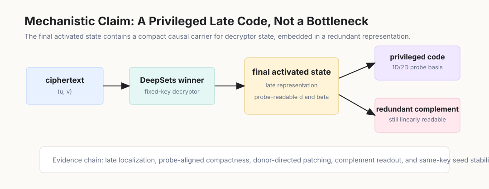
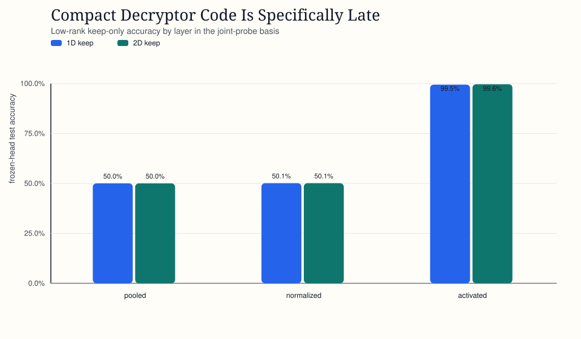
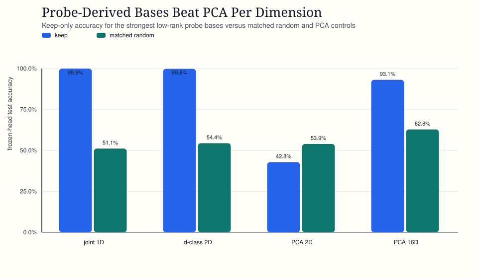
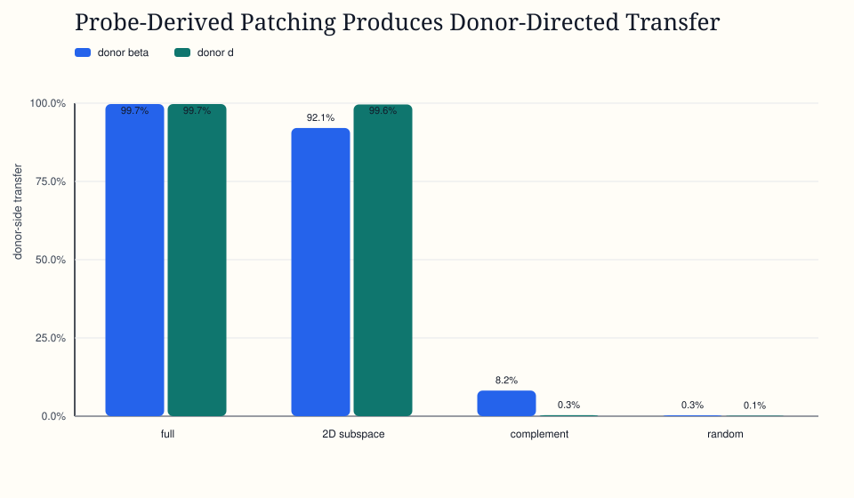
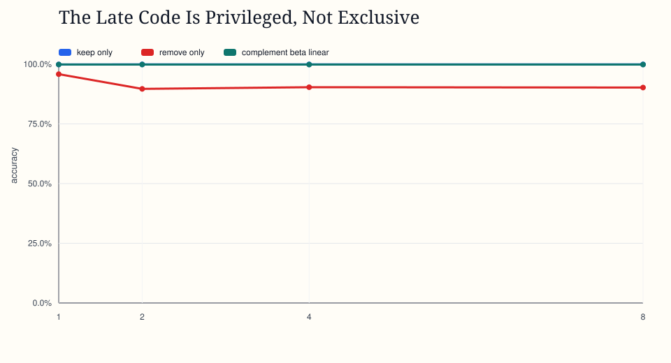
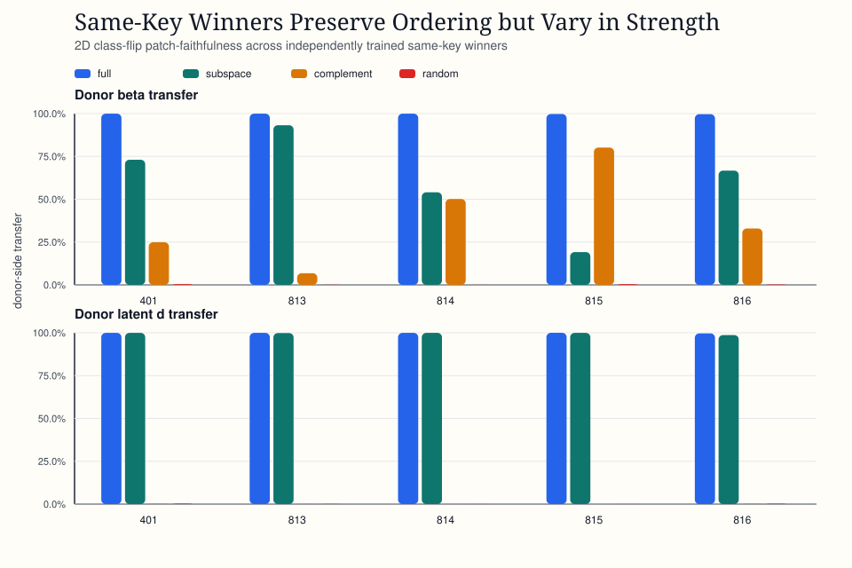

# Abstract

In a controlled fixed-key modular decryption task, successful DeepSets models expose the latent decryptor value in their final activated state. We ask whether this is only probe-readable information or whether, under patching interventions, the model actually routes computation through a small code.

We find a specifically late, probe-derived 1D/2D subspace that behaves like an internal almost-decrypted state. It preserves behavior far more efficiently than PCA or matched random controls: a 1D joint-probe direction preserves 99.92% mean test accuracy, while matched random 1D subspaces stay near chance. Patching the code moves the computation: full swaps copy donor behavior, random matched swaps leave the recipient largely unchanged, and probe-derived swaps induce coherent donor-directed transfer.

The code is privileged but not exclusive. Removing it weakens the frozen model, while the complement still supports near-perfect fresh readout. Across independently trained same-key winners, the effect is stable in kind and variable in strength. A solved neural decryptor therefore writes a compact late code for the decrypted state, but that code is backed by redundant late features rather than isolated as a unique bottleneck.

# 1. Introduction

This paper uses a tiny fixed-key regime by design: tiny regimes are where a mechanism can be named. A model is trained only on ciphertexts and output bits for one fixed secret key. In the regime studied here, small DeepSets models solve the task; the present question is what kind of internal object those solved models use.

\noindent
\begingroup
\setlength{\fboxsep}{6pt}
\setlength{\fboxrule}{0.4pt}
\fbox{\begin{minipage}{0.92\linewidth}
\textbf{High-level mechanistic question:} After learning the decryptor, is the almost-decrypted value a small code that moves behavior, or only something probes can read?
\end{minipage}}
\endgroup

Linear probes often find information that a model does not use. Bottleneck claims go too far in the other direction: they imply that the computation must pass through one uniquely necessary low-dimensional channel. This paper studies the middle object: a representation that is not the only place the computation lives, but is still the most efficient interventional handle on it.

The learned decryptor appears to write down a compact late code for the almost-decrypted state. The code is much more behaviorally efficient than PCA or random matched subspaces. It is specifically late, not inherited from pooled or normalized representations. It can be patched across examples to move the recipient toward donor behavior. But it is not the whole mechanism. The complement remains informative, and independently trained winners vary in how strongly downstream behavior follows the compact code.

The central claim is: learned fixed-key decryption produces a compact late code that behaves like an internal decrypted state. It is small, patchable, and privileged over generic directions, but embedded in a redundant representation rather than isolated as a bottleneck.

## 1.1 Contributions

- We localize the compact code to the final activated state; the same low-rank preservation test fails on earlier pooled and normalized views.
- We show that probe-derived 1D/2D bases are far more behaviorally efficient than PCA or matched random controls.
- We test causal relevance under patching: full swaps go donor-side, random matched subspaces stay recipient-side, and targeted probe-derived swaps move latent decryptor state and output behavior toward the donor.
- We show that the code is privileged but not exclusive: removing it weakens frozen-head behavior, but the complement still supports near-perfect fresh linear readout.
- We show that the phenomenon is stable in kind and variable in strength across independently trained winners.

# 2. Task and Candidate Code

We use a clean fixed-key modular decryption task. Each example contains ciphertext coordinates $(u, v)$ generated from one fixed secret $s$. The latent decryptor value is

$$
d = v - \langle s, u \rangle \bmod q,
$$

and the output bit beta is determined by whether $d$ falls in the decryption interval. The model sees ciphertexts and target bits. It does not see $s$ or $d$ during ordinary task training.

The main regime is:

- $n = 4$
- $m = 32$
- $q = 17$
- $\sigma = 0$

In this clean support, held-out examples have $d \in \{0, 8\}$ and a majority baseline near `50%`. The `d` and `d`-class language below refers to this supported decryptor state in the main regime; the probe head still has $q$ output classes, but the clean held-out support occupies two of them.

The models are independently trained DeepSets-style winners from this regime. We focus on their final activated state. The candidate code is a low-dimensional subspace of that state, derived from linear probes trained to predict either $d$, beta, or both.

We compare four basis families:

- joint-probe
- $d$-class probe
- PCA
- matched random subspaces

We test the candidate code along five axes: where it appears, whether it is privileged over generic low-rank directions, whether patching it changes behavior, whether the complement remains informative, and whether the pattern survives across independently trained winners. Repeated keep-only summaries are protocol-specific: localization, basis comparison, and complement geometry are separate retained analyses, so nearby 1D numbers should not be read as re-reports of one estimate. We also use one checkpoint trajectory as a timing sanity check, asking whether compact-code behavior and complement readout appear before or alongside task competence. Together, these tests separate the privileged-code claim from five weaker explanations:

- **Late localization:** pooled and normalized keep-only runs stay near chance, while activated 1D/2D keep-only reaches 99.45%-99.64%. The compact code localizes to the final activated state rather than a generic early statistic.
- **Basis comparison:** probe-derived bases preserve behavior where PCA and matched random controls fail. The effect depends on probe-aligned directions, rather than arbitrary low-rank bases.
- **Causal under patching:** full swaps go donor-side, random swaps stay recipient-side, and probe-derived swaps induce donor-directed transfer. The directions act as interventional handles, not only probe-readable correlates.
- **Complement geometry:** complement removal hurts frozen-head behavior, but the complement remains linearly readable, which rules out a unique tiny bottleneck.
- **Stable:** full/random ordering is stable across seeds, while privileged-subspace donor strength varies. The pattern is reproducible as an ordering, with seed-variable geometry.

{ width=95% }

The patch experiments need one important qualification. In this $q=17$ clean support, the cross-example patching setup flips between the two supported classes, $d=0$ and $d=8$. It is a class-flip faithfulness test, not a general latent-distance sweep. We interpret it as a directional causal test: does replacing a small subspace move a recipient example toward the donor's latent decryptor state and output behavior?

# 3. The Code Is Specifically Late

The first test is localization. If the compact code is just inherited from a generic earlier statistic, then the same low-rank keep-only procedure should work in earlier model views. It does not.

{ width=95% }

Across four winners in the localization sweep:

- pooled mean 1D keep-only accuracy: 50.03%
- normalized mean 1D keep-only accuracy: 50.13%
- activated mean 1D keep-only accuracy: 99.45%
- activated mean 2D keep-only accuracy: 99.64%

The contrast rules out the generic-early-statistic explanation in the tested setup. The compact representation appears to be organized at the final stage of the learned computation rather than merely carried forward from pooled or normalized views.

# 4. Probe-Aligned Directions Are Privileged

Once we are in the right layer, the next question is whether any low-rank basis would work. PCA is the natural control: if the result is just low-dimensional variance, PCA should preserve behavior efficiently. Matched random subspaces test the same question without the variance bias.

{ width=95% }

Across four winners in the basis-comparison run:

- joint-probe mean 1D keep-only accuracy: 99.92%
- joint-probe mean 1D random keep-only accuracy: 51.13%
- $d$-class probe mean 2D keep-only accuracy: 99.79%
- $d$-class probe mean 2D random keep-only accuracy: 54.40%
- PCA mean 2D keep-only accuracy: 42.84%
- PCA mean 8D keep-only accuracy: 85.03%
- PCA mean 16D keep-only accuracy: 93.10%

This rules out the generic-low-rank explanation in the tested setup. The late representation does not merely contain information about the decryptor; it contains a small privileged carrier for that information.

# 5. Patching the Code Moves the Decryptor

The next test is causal in the intervention sense defined above. We patch activated states between examples and compare four interventions:

- full swap
- probe-derived subspace swap
- complement swap
- matched random subspace swap

The clean bracket is the point. Patching the whole state should copy the donor. Patching a random matched subspace should leave the recipient largely alone. Patching the probe-derived subspace should push the recipient toward the donor if this code is an interventional handle rather than a readable decoration.

{ width=95% }

Within-model patching shows exactly that bracket:

- key-401, 1D patch:
  - donor $d$ transfer: 98.97%
  - donor beta transfer: 75.10%
- key-401, 2D patch:
  - donor $d$ transfer: 99.58%
  - donor beta transfer: 92.07%
- key-402, 2D replication:
  - donor $d$ transfer: 99.98%
  - donor beta transfer: 81.76%

In this patching setup, the code is causal rather than decorative. Replacing the probe-derived activated-state code can carry the donor decryptor state into the recipient computation, while random matched directions do not.

# 6. The Complement Carries Redundant Signal

The bottleneck story fails in an interesting way. If the privileged subspace were the only carrier of the computation, then removing it should destroy useful task information. Instead, the complement remains highly readable.

{ width=95% }

For the same probe-derived bases in the complement-geometry run:

- joint-probe mean 1D keep-only accuracy: 99.90%
- joint-probe mean 1D remove accuracy: 95.84%
- joint-probe mean 1D complement beta linear accuracy: 99.88%
- $d$-class probe mean 2D keep-only accuracy: 97.47%
- $d$-class probe mean 2D remove accuracy: 85.19%
- $d$-class probe mean 2D complement beta linear accuracy: 99.90%

The privileged subspace matters to the frozen model, but the removed complement is not empty. It can still support near-perfect fresh linear beta readout. The mechanism is therefore asymmetric rather than exclusive: a compact code carries decryptor state with unusual behavioral efficiency, while the broader representation keeps enough backup structure to remain informative after removal.

The redundancy makes the result more plausible. A compact privileged code with backup structure is a more plausible learned object than a perfectly isolated chokepoint. A merely probe-readable cloud would be weak; the observed object is sharper: a privileged carrier embedded in a redundant late state.

# 7. Stable in Kind, Variable in Strength

The final main test is seed stability. We repeated the class-flip patch-faithfulness setup across key-401, seed-813, seed-814, seed-815, and seed-816, with 1D and 2D probe-derived subspaces plus the same control family. Ten runs were evaluated in total.

{ width=95% }

The stable part of the result is unambiguous:

- full swap remains nearly perfect:
  - mean donor beta transfer: 99.82%
  - mean donor $d$ transfer: 99.89%
- random matched subspaces remain recipient-dominant:
  - mean donor beta transfer: 0.22%
  - mean donor $d$ transfer: 0.18%

The privileged subspace remains real on average, but its strength varies:

- pooled across all 10 runs, $d$-subspace swap mean donor beta transfer: 52.45%
- pooled across all 10 runs, $d$-subspace swap mean donor $d$ transfer: 87.06%
- in the cleaner 2D case:
  - mean donor beta transfer: 61.23%
  - mean donor $d$ transfer: 99.68%
  - donor beta transfer range across seeds: 19.14% to 93.21%

The complement tells the other half of the story: it can still affect output behavior without reliably carrying the donor decryptor state.

The same qualitative ordering appears without requiring the identical tiny plane in every model. Full swaps, random controls, and probe-derived subspaces keep the same qualitative ordering; the amount of donor control carried by the privileged subspace changes across winners.

# 8. Discussion: Privileged Code, Not Bottleneck

The evidence supports a specific mechanistic object.

First, the code is late-localized. Earlier internal states do not support useful 1D/2D behavior; the final activated state does.

Second, it is privilegedly compact. Probe-derived directions preserve behavior at dimensions where PCA and random controls remain near chance.

Third, it is causal under the class-flip patching intervention. Full swaps go donor-side, random matched subspaces stay recipient-side, and targeted probe-derived swaps move both the latent decryptor and the output in the donor direction.

Fourth, it is redundant rather than exclusive. The complement is weaker for the frozen head but still contains substantial readout signal.

Fifth, seed stability holds at the level of the phenomenon, while strength remains seed-variable.

A checkpoint run adds a timing check. The code does not appear long before competence, and redundancy does not appear only after competence. In the observed training trajectory, full-model accuracy, 1D keep-only behavior, and complement readout rise together between the weak early checkpoint and the solved model.

## 8.1 Stronger Readings The Evidence Rules Out

The seed expansion argues against treating fixed-key decryption as a universal 1D/2D bottleneck.

The class-flip patching setup should not be read as a general latent-distance theory of the decryptor.

The compact subspace also captures only part of the useful trained representation. The complement remains informative, and the seed battery shows variable downstream reliance on the privileged code. The claim is internal and mechanistic: this trained decryptor family develops a compact causal carrier inside a larger late representation.

# 9. Limitations

The regime is small: clean fixed-key $n=4, q=17, \sigma=0$. That smallness is the method, not an apology; it is what makes the causal object legible. The remaining limits are:

- The source models all come from one successful architecture family.
- The patch-faithfulness setup is a class-flip test rather than a full latent-distance sweep.
- The seed battery supports a stable phenomenon with variable strength, not seed-invariant geometry.
- The complement readout result means the code is privileged, not exclusive.

# 10. Conclusion

A trained fixed-key decryptor exposes useful late-state information almost linearly, but that fact alone does not identify a mechanism. The patching experiments make the claim causal in the class-flip intervention sense.

The computation lands between two unhelpful extremes: a single magic direction and a representation where every direction is equivalent. The model builds a privileged late carrier: small enough to patch, efficient enough to beat PCA, and redundant enough to survive damage.

The mechanistic object is a compact late code for learned fixed-key decryption, far more effective per patched dimension than generic subspaces, embedded inside a broader redundant representation.
