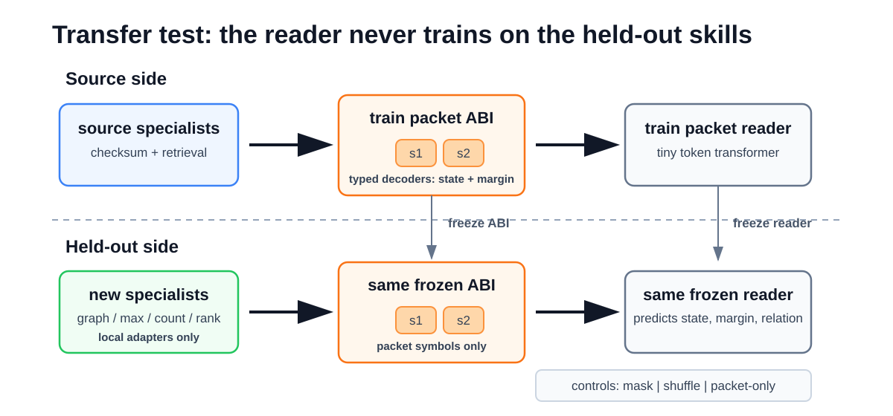
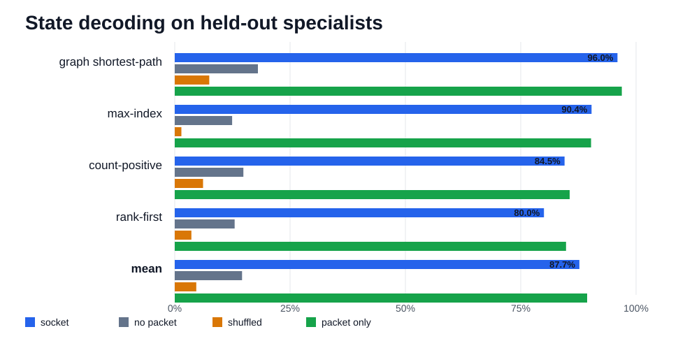
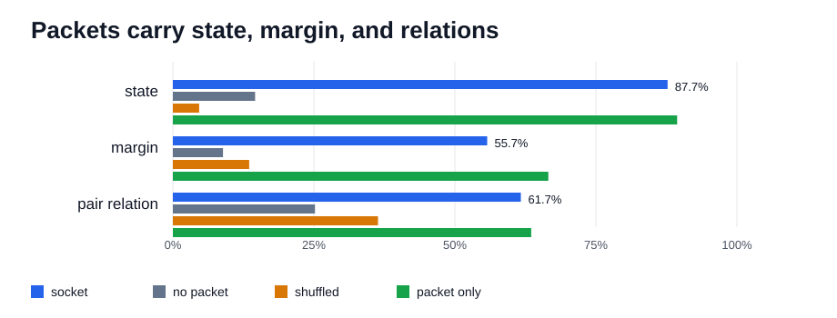

# Abstract

Language models usually meet tools through interfaces designed for humans: names, schemas, text, JSON, and function arguments. That is a good fit for software. It is a strange fit for neural specialists. A neural ranker, retriever, verifier, or graph solver already has compact internal structure: answer state, confidence, ambiguity, and local comparisons. The interface does not have to be English first.

We test a smaller interface. Source-domain neural specialists train a frozen typed packet socket. Held-out specialists from unrelated skills then compile into that same socket through local adapters. A tiny transformer receiver is trained only on source socket messages and is evaluated on held-out graph shortest-path, max-index, count-positive, and rank-first packets.

The receiver is trained from scratch; in this paper, "language model" means a small token-sequence transformer over packet messages, not a pretrained natural-language model.

Across three independent replications, held-out packet state is read near `90%` accuracy. No-packet and shuffled controls collapse, while packet-only reading is slightly stronger than the full message.

The packet carries more than a label. Across the same held-out skills, pair-relation reading stays strong and confidence-like margin remains present but weaker. A much smaller reader keeps the effect.

The result supports a concrete interface: a language-shaped transformer learns a neural packet ABI on source specialists and keeps reading when the specialist skill changes. Specialists do specialist work, then expose compact typed packets that language-facing models can read without inheriting the whole specialist. That is a route to neural tool use where the interface is not prose wrapped around a model, but a learned calling convention between models.

# 1. Introduction

The standard AI tool story puts a language model in the center. It reads a request, selects a tool, writes arguments, receives a response, and continues in text. Toolformer, ToolLLM, Gorilla, HuggingGPT, and related systems all make that pattern more capable [1,2,3,4].

That pattern also bakes in a human-facing interface. The tool must be named. The arguments must be serialized. The result must be turned back into text or a structured software object.

For calendars, databases, and ordinary APIs, that is the right bargain. For neural tools, it may be the wrong layer. A neural specialist is not naturally a REST endpoint. It has activations, margins, internal alternatives, and compact task states. A learned packet can expose those objects directly.

The key question is whether a tiny language-like receiver can read such packets after the skill behind the packet changes. If a reader can learn the interface once and keep using it on unrelated specialists, the interface starts to look like an ABI rather than a task-specific compression trick.

The ABI analogy is useful because an ABI is not a description of a program. It is a calling convention. It says which registers matter, how arguments are packed, and what the callee promises to leave behind. A neural packet ABI plays the same role at a different layer. It does not ask the graph solver to explain graphs in English, and it does not ask the reader to become a graph solver. It asks the solver to place task-local state into fixed packet slots whose semantics have already been learned.

The payoff is modularity. If the interface works, a language-facing model can sit above many neural specialists without absorbing each specialist into its own weights and without forcing every specialist through a verbose human API. Adding a new skill becomes a smaller problem: adapt the new specialist into the socket, then let the existing reader consume the packet. The user sees a new capability; the system sees the same typed packet contract.

The experiment is deliberately controlled. Source specialists come from modular checksum and dot-product retrieval domains. The held-out specialists come from unrelated domains: graph shortest-path, max-index, count-positive, and rank-first. The socket emits two discrete symbols. Frozen decoders attach typed meaning to those symbols. A transformer receiver sees packet-token messages and predicts typed state, margin, or a relation between two packets.

The key separation is between *adapting into the socket* and *teaching the reader*. Held-out specialists get local adapters into the already trained socket, but the receiver is trained on source-domain messages. The reader does not get to practice on graph, max-index, count-positive, or rank-first messages before test time.

The payoff is transfer rather than raw compression. The receiver is trained on source-domain packets. It is then evaluated on packets emitted for held-out tasks it did not train on. When only the packet symbols remain, the result stays strong.

{ width=100% }

\newpage

# 2. A Socket Instead of a Text API

The socket is a small typed ABI. Each emitted packet has two slots:

| field | value |
|---|---|
| slot 1 | discrete symbol |
| slot 2 | discrete symbol |

The small address space is intentional. The socket is not a hidden continuous embedding handed wholesale to the receiver. It is a discrete packet interface with a fixed number of slots and a fixed codebook.

The ABI has frozen readers for two targets:

| target | meaning |
|---|---|
| state | the task's answer bucket |
| margin | a confidence-like ambiguity bucket |

Every task maps into the same type signature, even when the task itself is different. For graph shortest-path, state is a path-length bucket. For max-index, state is the index of the largest item. For count-positive, state is a count bucket. For rank-first, state is a rank bucket.

The common type signature creates the reusable surface. The state label is task-local, but the packet discipline is shared: emit a typed answer bucket and a confidence-like ambiguity bucket through the same two-slot interface. The held-out adapter has to learn how its own specialist should inhabit that interface; the receiver has to learn how to read the interface without being retrained for the held-out skill.

Four objects are deliberately separated:

| object | trained on | frozen at held-out test? | role |
|---|---|---:|---|
| source specialists | checksum and retrieval | yes | create source packets |
| socket ABI | source payloads | yes | fix slot semantics |
| held-out adapters | held-out payloads | no, then yes | compile new senders |
| transformer reader | source packet messages | yes | read after skill change |

That separation blocks the easy interpretation. The result is not that a transformer learns a new supervised label task after seeing examples from that task. It is trained to read one family of socket messages, then tested on messages produced by different specialist computations.

The receiver is a two-layer transformer over a short token sequence, trained from scratch for the packet-reading task. That choice makes the test strict: transfer has to come from the socket contract rather than background knowledge. The message contains wrapper tokens and the two packet symbols. In the packet-only control, the wrapper tokens are masked away, leaving only the packet symbols.

The main receiver is a small two-layer token transformer. A smaller follow-up receiver is used as a capacity control.

## One Packet Trace

Here is one real held-out packet trace selected only to avoid the misleading case where symbol IDs numerically match decoded labels. The symbol names are learned packet tokens, not hand-written answer labels. The wrapper tokens frame the message for the token reader; `<MASK>` hides those wrapper tokens in the packet-only control while leaving the two packet symbols visible.

```text
task: count_positive
input_id: count_positive_test_3066
specialist_answer: state=count_bucket=5, margin=margin_bucket=0
packet: slot_1=S13, slot_2=S30
receiver_message: <BOS> <TASK> <SENDER_0> <SEP> S13 S30
packet_only_message: <MASK> <MASK> <MASK> <MASK> S13 S30
frozen_decoder_output: state=count_bucket=5, margin=margin_bucket=0
transformer_reader_output: state=count_bucket=5, margin=margin_bucket=0
packet_only_reader_output: state=count_bucket=5, margin=margin_bucket=0
```

This is the object the experiment is about: a specialist emits two discrete symbols, the typed ABI decoder gives those symbols state and margin meaning, and the token reader consumes the same symbols as a tiny message. The packet-only control keeps exactly the two learned symbols and masks the wrapper.

# 3. Experimental Setup and Controls

The replicated battery reports means over three independent trainings. Each replication redraws random seeds for data, specialist training, ABI training, held-out adaptation, and receiver training.

Each run follows the same pipeline:

1. Train source-domain neural specialists.
2. Train one frozen packet ABI on source-domain payloads.
3. Fit held-out specialist adapters into the frozen ABI.
4. Train the transformer receiver on source packet messages.
5. Evaluate that receiver on held-out specialist packets.

The core state-reading test asks the receiver to predict the held-out packet's typed state.

The main battery uses two checksum source senders and two dot-product retrieval source senders. The held-out side uses one sender per unrelated skill: graph shortest-path, max-index, count-positive, and rank-first. Each domain has `12,288` train examples, `3,072` validation examples, and `3,072` test examples per run.

The packet has two discrete slots. Each slot has a `32`-symbol codebook, so the packet address space is `32 x 32`, and the tokenized receiver vocabulary contains `32` wrapper and control tokens plus `64` packet-symbol tokens. State has `8` classes. Margin has `6` classes. Pair relation has `4` classes.

The source ABI is a straight-through discrete encoder with separate frozen MLP decoders for state and margin. It is trained for `72` epochs with AdamW at learning rate `1e-3`, batch size `1024`, hidden dimension `160`, and a source ABI training budget of `6,144` examples per source sender. The main loss is state and margin cross-entropy through the two-slot packet, with auxiliary slot anchors for state and margin and a small usage-entropy term.

Held-out specialists do receive supervision, but only to fit local encoders into the already trained ABI. For each held-out skill, the state and margin decoders are frozen. A local adapter encoder is trained for `48` epochs on `2,048` examples from that held-out skill, using state and margin supervision through the frozen decoders. After that adapter is fit, the adapter and ABI are frozen for receiver evaluation.

This is the operational meaning of "compile into the socket." The held-out adapter is allowed to learn how its specialist should emit the two packet symbols. The reader is not allowed to learn from held-out skill messages. The claim is therefore not zero-shot sender learning. It is frozen-reader interface transfer: once a new specialist has been locally adapted into the packet ABI, the source-trained reader keeps reading the packet.

The receiver is a two-layer transformer encoder over short packet-token messages. The main receiver uses hidden dimension `160`, four attention heads, no dropout, AdamW at learning rate `1e-3`, batch size `1024`, and `64` training epochs. It is trained only on source-domain packet messages. Single-packet messages have length `6`; pair messages have length `10`. A smaller follow-up receiver repeats the test with hidden dimension `64`.

The nominal uniform chance baselines are `12.5%` for state, `16.7%` for margin, and `25.0%` for pair relation. Reported replication tables use mean and standard deviation over `n = 3` independent runs. A companion baseline pass also records majority-class baselines, balanced accuracy, confusion matrices, simple non-transformer readers, and codebook-utilization statistics. Because held-out task label distributions and transferred source priors can be uneven, the no-packet and shuffled controls are still the most important empirical baselines.

The controls decide whether the reader learned the packet or merely learned the wrapper:

| condition | input | what it rules out |
|---|---|---|
| socket | the real held-out packet message | full interface transfer |
| no packet | packet symbols are replaced by a mask | task priors from the wrapper |
| shuffled | packet-shaped inputs remain, but symbol identity is broken | gains from packet-looking syntax alone |
| packet only | every non-packet token is masked; only the two packet symbols remain | reliance on prefix, separators, or task text |

The packet-only control is the sharpest one. It masks the message wrapper and leaves only the two packet symbols. If packet-only reading works, the result is not riding on the prompt wrapper.

The shuffled control is different. It preserves the packet-shaped input format while breaking symbol identity. That catches a weaker failure mode: a model could learn that the existence of two packet-looking tokens predicts a task prior without learning the packet symbols themselves. The no-packet and shuffled controls fail for state reading, while packet-only stays strong.

The packet-only result also clarifies the word "language." The reader is language-shaped, but English explanations are not doing the work. The useful inductive bias is sequence reading: token identity, token order, and small compositional contexts. The tiny transformer is acting less like a chatbot and more like a learned packet parser.

# 4. What the Reader Has to Learn

The receiver sees an intentionally tiny message. It does not receive the raw graph, array, checksum inputs, retrieval query, specialist activations, or decoded ABI labels. It receives a short token sequence containing the packet symbols, and it must map those symbols to a typed output.

That sounds easy only if the packet vocabulary already has fixed human semantics. It does not. The meaning of a symbol is induced by the source specialists and frozen ABI decoders. A token can be useful only through its position in the learned packet codebook and its interaction with the other slot.

There are three nested generalizations:

| level | generalization |
|---|---|
| within source | learn to read packet messages produced by source specialists |
| across senders | keep reading after a held-out specialist adapts into the same ABI |
| across tasks | preserve typed meaning when the specialist computation changes |

The last level is the central test. A graph shortest-path specialist and a max-index specialist do not share the same input space, algorithm, or natural answer vocabulary. The shared object is the typed packet discipline: a compact state-like slot structure and a confidence-like margin structure that the receiver can read after the specialist changes.

This is why the result is closer to an interface experiment than a compression experiment. A compression experiment would ask how many bits are needed to preserve a label. The socket experiment asks whether a fixed low-bandwidth convention can become reusable across models that solve different problems.

# 5. Main Result: The Reader Transfers

Across three independent trainings and four unrelated held-out skills, the receiver reads state from real socket packets far above both controls. Packet-only reading is slightly stronger than the full message.

{ width=100% }

The per-skill pattern is broad. Graph shortest-path is the easiest held-out reader target, but max-index, count-positive, and rank-first all stay far above the controls. Even the weakest held-out state row remains well separated from no-packet and shuffled baselines.

The full-message and packet-only comparison is especially useful. If the prefix tokens were carrying the win, masking them would kill the result. Instead, removing the wrapper leaves the signal intact. The receiver has learned the packet itself.

The two symbols are neither a natural-language answer nor a dense activation dump. They are closer to a tiny register file. Once the reader has learned the calling convention, an unrelated specialist can place its state into the same slots and become readable.

# 6. Structure in the Packet

A useful socket should expose an interface, not one lucky label channel. The first check asks whether the reader can recover typed signals beyond the main state bucket:

| target | question |
|---|---|
| margin | can the receiver read a confidence-like ambiguity bucket? |
| pair relation | given two packets, can it classify state-bucket agreement and larger margin? |

State is the cleanest result. Pair relations are also clear: they remain far above chance and no-packet controls. Margin is useful but weaker; it carries signal, especially in packet-only form, but it should be read as supporting evidence rather than the headline.

Margin matters because a specialist interface should not expose only its final bucket. Many downstream decisions depend on ambiguity: whether to ask for another specialist, abstain, compare two candidate answers, or route the case into a slower path. A packet that carries a confidence-like signal is more useful than a packet that merely says "class three."

The pair-relation probe is the more compositional diagnostic. The reader receives two packets and predicts a relation that depends on both. This is not the same as decoding one packet twice and printing two answers; it asks whether packet-coded state and margin structure can be compared inside the receiver.

\newpage

{ width=100% }

The table reports mean accuracy over three independent replications, with standard deviation in parentheses.

| target | chance | socket | no packet | shuffled | packet only |
|---|---:|---:|---:|---:|---:|
| state | `12.5%` | `87.7 (2.5)%` | `14.6 (2.1)%` | `4.7 (3.8)%` | `89.4 (2.2)%` |
| margin | `16.7%` | `55.7 (10.5)%` | `8.9 (11.0)%` | `13.5 (5.1)%` | `66.6 (2.0)%` |
| pair relation | `25.0%` | `61.7 (3.8)%` | `25.2 (0.9)%` | `36.4 (4.5)%` | `63.5 (2.2)%` |

A separate fresh-seed diagnostic pass gives the weaker numbers their class-balance context. It uses a different three-seed run than the headline table above, so the `78.6%` state row is a calibration result rather than a conflicting copy of the `87.7%` headline result. State and pair remain well above majority and chance under balanced accuracy. Margin is close to the majority baseline in raw accuracy, so the conservative reading is that margin is a weaker auxiliary field rather than a second state-like channel.

| target | socket accuracy | balanced accuracy | majority | chance |
|---|---:|---:|---:|---:|
| state | `78.6 (2.5)%` | `69.3 (1.6)%` | `22.4%` | `12.5%` |
| margin | `59.4 (8.0)%` | `39.1 (6.3)%` | `55.4%` | `16.7%` |
| pair relation | `59.0 (0.8)%` | `59.0 (0.8)%` | `26.2%` | `25.0%` |

The second check asks whether a language-shaped transformer is required to read the packet. It is not. In the same baseline pass, simple readers trained on source packet messages also read held-out packets:

| reader | state accuracy | state balanced | pair accuracy |
|---|---:|---:|---:|
| lookup | `80.5 (3.5)%` | `70.8 (4.3)%` | `44.7 (2.6)%` |
| linear | `86.3 (3.0)%` | `76.8 (4.7)%` | `35.9 (1.3)%` |
| MLP | `86.4 (5.3)%` | `77.2 (3.9)%` | `63.4 (0.4)%` |

That result strengthens the ABI interpretation. A good calling convention should be parseable by simple consumers. The transformer reader is useful because it is a language-shaped packet consumer, not because the packet can only be decoded by a transformer.

The third check asks whether the two-symbol codebook collapsed into a few degenerate cases. It did not. Across held-out skills in the baseline pass, the packet uses dozens of active symbol pairs and carries measurable association with state:

| utilization metric | value |
|---|---:|
| active symbol pairs | `55.3 (12.8)` |
| top pair frequency | `13.8 (1.7)%` |
| normalized pair entropy | `0.446 (0.023)` |
| mutual information with state | `2.245 (0.013)` bits |
| mutual information with margin | `0.737 (0.105)` bits |

Taken together, the typed probes, simple-reader baselines, and utilization check give the packet a richer shape. State is the cleanest channel, pair comparison is robust, margin is present but weaker, and the codebook is used as a compact interface rather than a single magic token.

The frozen ABI decoders and the token reader play different roles. The decoders define what a valid packet means after a held-out adapter emits it. The transformer reader tests whether the same packet can be consumed as a short token message after training only on source-domain messages.

| target | frozen ABI decoder | transformer reader | packet-only reader |
|---|---:|---:|---:|
| state | `88.6 (3.1)%` | `87.7 (2.0)%` | `89.4 (1.8)%` |
| margin | `67.4 (2.1)%` | `55.7 (8.5)%` | `66.6 (1.6)%` |

For state, the token reader essentially matches the frozen decoder. For margin, the full-message reader is noisier, while the packet-only reader is close to the direct decoder. That pattern supports the narrower interpretation: the packet symbols already carry the typed signal, and the language-shaped receiver is learning to parse that packet rather than solving the held-out task from raw inputs.

# 7. The Effect Survives a Smaller Reader

To check whether the result depends on receiver capacity, a follow-up run repeats the reader test with a much smaller token transformer.

| target | socket | no packet | shuffled | packet only |
|---|---:|---:|---:|---:|
| state | `85.1%` | `6.5%` | `2.9%` | `88.3%` |
| margin | `60.1%` | `20.8%` | `27.1%` | `68.0%` |
| pair relation | `66.9%` | `26.2%` | `32.1%` | `67.6%` |

The smaller reader keeps the result. It reads graph packets almost perfectly, keeps max-index and count-positive strong, and remains positive on rank-first. Reducing receiver capacity changes individual rows, but not the interface-level conclusion.

This run narrows the mechanism. A high-capacity receiver could memorize incidental details of the source packet distribution and still look impressive on a small benchmark. The smaller reader has less room for that story. It keeps the socket readable, including the packet-only condition, which pushes the interpretation toward a compact convention rather than a lucky overfit.

# 8. Packet Traces Can Teach New Senders

A socket is more useful if new models can learn to produce packets, not only read them. Two additional probes test that direction.

First, a packet-trace student was trained to imitate held-out teacher packets from raw task inputs. Frozen ABI decoders then read the student's packets. The student recovered much of the held-out state signal, with graph shortest-path and max-index transferring especially well.

Second, an invented-socket probe removed the explicit slot-format objective and asked whether a less directly supervised socket could still admit held-out adapters. It transferred above chance, though less cleanly than the supervised socket.

| probe | mean held-out state |
|---|---:|
| packet-trace student | `77.7%` |
| invented socket | `70.5%` |

The packet-trace student is a sender-side version of the same idea. Instead of asking whether a reader can consume a packet, it asks whether a new model can learn to speak the packet format from examples. The frozen ABI decoders then serve as the judge: if the student emits the right kind of packet, the decoders should recover the state.

The invented-socket probe removes some direct slot supervision and asks whether a less hand-shaped packet convention can still accept held-out adapters. It does, though less cleanly. The useful lesson is narrow: the socket need not be an English schema or a full activation dump, but it does benefit from a real typed contract.

Together, these probes show the socket acting as more than a readout. It can be imitated from packet traces, and less directly supervised sockets can still admit held-out adapters. The interface is compact enough to read and concrete enough for new senders to learn.

# 9. Why the Specialist Should Emit the Packet

The packet reader receives a compact specialist message. A prompt-to-packet caller has a harder job: it sees command-like tokens plus raw inputs and must emit a packet that the frozen ABI decoders will interpret correctly. That caller is trying to solve the specialist task and speak the socket at the same time.

A prompt-to-packet control trained a tiny transformer caller through the frozen ABI decoders. It reached `18.8%` mean state accuracy, versus `16.8%` with no command and `14.4%` with the wrong command, for only a `2.0` point lift over no-command.

That boundary favors a router-reader architecture. The neural specialist emits the packet; the language-facing model reads, routes, compares, or explains it. The packet socket is strongest when it connects models, not when it asks the reader to replace the model that produced the evidence.

This division of labor is important for making the result feel practical. A language-facing model does not need to become a graph solver, a ranker, a verifier, and a retriever all at once. It needs an interface that lets specialists expose their compact internal decisions in a form the language-facing model can consume.

The caller control also says something technical: the frozen decoders are not a cheap reward surface for learning the underlying specialist task from scratch. Producing a valid packet is a real sender problem. Reading a valid packet is the part that transfers cleanly here.

# 10. Relation to Prior Work

Tool-using language model systems usually train or prompt an LLM to call software APIs. Toolformer teaches a model when and how to call external tools [1]. ToolLLM and Gorilla scale tool calling across large API collections [2,4]. HuggingGPT uses a language model as a controller over a set of external models, with language as the generic interface [3].

This work studies a lower-level interface. The tool does not return text, and the receiver does not parse JSON. A neural specialist emits a tiny typed packet. A token transformer learns to read the packet contract.

Emergent-communication work studies agents that learn messages for cooperation [5,6]. Discrete-Valued Neural Communication studies discrete communication between components inside structured neural architectures, including transformers, modular architectures, and graph neural networks, and shows that shared discrete codebooks can improve systematic generalization [7]. Translating Neuralese studies mappings between learned messages and human language [9]. Latent communication studies reuse and translation of internal representations across independently trained networks [8].

The socket test is operationally closest to DVNC, but it asks a different interface question. DVNC discretizes communication inside a structured model family. Here, separately trained specialists are locally adapted into an externally reusable packet ABI, the typed state and margin decoders are frozen, and a source-trained reader is evaluated on unrelated held-out skills. The emphasis is less on improving one architecture's internal OOD generalization and more on whether a frozen model-to-model packet contract remains readable after the sender skill changes.

The socket test is also operationally different from Neuralese translation and latent communication. The sender and receiver are not jointly trained end to end on every held-out skill. The held-out specialist enters a frozen packet ABI, and the same reader is tested on the resulting message.

The experiment also differs from ordinary representation transfer. In representation transfer, one often asks whether a hidden state from one model can be aligned to another model's hidden state. Here the interface is not an arbitrary latent vector. It is a tiny discrete packet with a typed decoding contract. That makes the result stricter in bandwidth and more directly usable as a model-to-model interface.

# 11. Limitations

This is not yet a general neural ABI. The held-out skills are synthetic. The packet type signature is hand-shaped. Held-out adapters are still trained with state and margin supervision. The source and held-out specialists are small, and the packet codebook is tiny by design.

Those constraints are part of the claim. The experiment does not show that any arbitrary neural model can immediately speak a universal packet language. It shows a narrower result: under controlled conditions, a frozen two-slot discrete ABI can preserve readable state, confidence-like margin, and pairwise comparison signal across unrelated specialists after only local sender adaptation.

The margin probe is less clean than state. It beats the empirical controls, and packet-only reading remains strong, but its variance and class-balance dependence make it supporting evidence rather than the headline result. Pair relation is cleaner under balanced accuracy, but it is still a probe of packet structure rather than the main transfer claim.

# 12. Conclusion

Neural tools do not have to speak English to be useful to language systems.

In these experiments, unrelated specialists emit two-symbol packets into a frozen typed socket. A tiny transformer receiver trained on source-domain packets reads held-out graph, max-index, count-positive, and rank-first packets with high accuracy. No-packet and shuffled controls collapse. Packet-only reading is stronger than the full message.

The result is compact and practical: a neural specialist can expose a small packet ABI, and a language-shaped model can learn to read that ABI after the skill behind the packet changes.

The short version is that a tiny language-shaped model can plug into unfamiliar neural specialists and read their packets. The technical version is sharper: a frozen two-slot discrete ABI preserves strong typed state, pairwise comparison signal, and a weaker confidence-like margin across unrelated senders, with controls showing that the signal lives in the packet symbols themselves.

The reason to care is not that two symbols are magical. It is that the two symbols are enough to make the boundary move. Instead of treating a neural specialist as a black box that must speak English, or a latent vector that must be swallowed whole, the socket gives it a small typed surface. That is exactly the kind of surface modular neural systems need: compact enough to standardize, expressive enough to route, compare, and compose.

# References

[1] Timo Schick, Jane Dwivedi-Yu, Roberto Dessi, Roberta Raileanu, Maria Lomeli, Eric Hambro, Luke Zettlemoyer, Nicola Cancedda, and Thomas Scialom. "Toolformer: Language Models Can Teach Themselves to Use Tools." arXiv:2302.04761, 2023.

[2] Yujia Qin, Shihao Liang, Yining Ye, Kunlun Zhu, Lan Yan, Yaxi Lu, Yankai Lin, Xin Cong, Xiangru Tang, Bill Qian, Sihan Zhao, Lauren Hong, Runchu Tian, Ruobing Xie, Jie Zhou, Mark Gerstein, Dahai Li, Zhiyuan Liu, and Maosong Sun. "ToolLLM: Facilitating Large Language Models to Master 16000+ Real-world APIs." arXiv:2307.16789, 2023.

[3] Yongliang Shen, Kaitao Song, Xu Tan, Dongsheng Li, Weiming Lu, and Yueting Zhuang. "HuggingGPT: Solving AI Tasks with ChatGPT and its Friends in Hugging Face." arXiv:2303.17580, 2023.

[4] Shishir G. Patil, Tianjun Zhang, Xin Wang, and Joseph E. Gonzalez. "Gorilla: Large Language Model Connected with Massive APIs." arXiv:2305.15334, 2023.

[5] Jakob N. Foerster, Yannis M. Assael, Nando de Freitas, and Shimon Whiteson. "Learning to Communicate with Deep Multi-Agent Reinforcement Learning." arXiv:1605.06676, 2016.

[6] Angeliki Lazaridou, Alexander Peysakhovich, and Marco Baroni. "Multi-Agent Cooperation and the Emergence of (Natural) Language." arXiv:1612.07182, 2016.

[7] Dianbo Liu, Alex Lamb, Kenji Kawaguchi, Anirudh Goyal, Chen Sun, Michael C. Mozer, and Yoshua Bengio. "Discrete-Valued Neural Communication." NeurIPS, 2021.

[8] Luca Moschella. "Latent Communication in Artificial Neural Networks." arXiv:2406.11014, 2024.

[9] Jacob Andreas, Anca Dragan, and Dan Klein. "Translating Neuralese." ACL, 2017.
