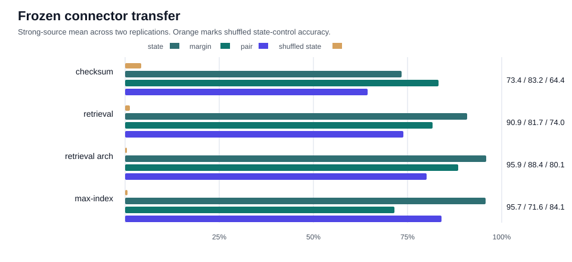

# Abstract

Neural systems usually connect through interfaces made for humans: text, JSON, tool calls, labels, logits, or raw hidden states. These are useful surfaces, but they are awkward as a native model-to-model connector. Text is bulky. Labels are narrow. Hidden states are private to one model's coordinate system.

This paper asks whether small specialist networks can instead use a frozen typed packet connector. The connector is trained once on two source domains, modular checksum and vector retrieval. It then stops learning. New specialists are allowed to train only local encoders into the frozen packet socket. The packet itself is tiny: two choices from a 32-symbol codebook. Its typed contract is state plus confidence.

The result is surprisingly strong. In two strong-source replications, held-out checksum specialists connect at 73.4% state and 83.2% margin accuracy. Held-out retrieval specialists connect at 90.9% and 81.7%. A different candidate-wise retrieval architecture connects at 95.9% and 88.4%. Most importantly, an unseen max-index specialist, trained on a task that does not look like checksum or retrieval, connects at 95.7% state and 71.6% margin. Pairwise semantic judgments transfer to the max-index domain at 84.1%, versus 43.4% under shuffled packets.

A random frozen connector does not explain the effect. With the same adapter protocol and strong specialists, max-index state falls to 44.8%, margin to 10.8%, and pair semantics to 29.7%. Source training of the packet ABI is doing real work.

The claim is not that models spontaneously share a hidden language. They do not need to. The claim is that a small, frozen, typed connector can become a reusable socket for otherwise unrelated neural specialists after local compilation.

# 1. Introduction

Model systems increasingly look like collections of specialists. One model retrieves. Another ranks. Another checks a structured condition. Another writes or plans. The usual question is how to make them talk.

The default answer is to make them talk to us. A model emits text. It serializes JSON. It calls a tool. It returns logits or labels. These interfaces are practical, but they are not a natural connector between neural circuits. They force internal computation through a human-facing bottleneck or expose raw hidden states whose coordinates are meaningful only inside one model.

The missing object is a connector: small enough to be cheap, semantic enough to be testable, and stable enough that specialists trained later can plug into it.

This paper studies a deliberately controlled version of that object. A frozen packet connector is trained from two source domains. Each packet has two slots, each slot chooses one of 32 symbols, and frozen decoders attach typed meaning to the packet: state/class and confidence/margin. After this connector is frozen, held-out specialists can only learn local encoders into it. The connector's decoders and downstream source-trained semantic heads do not move.

The core question is simple: can a specialist trained on a different task still plug into the socket?

We test four held-out cases:

- held-out modular checksum specialists
- held-out dot-product retrieval specialists
- candidate-wise retrieval specialists with a different computation graph
- max-index specialists, which see a real-valued vector and choose the largest slot

The max-index case is the high-signal test. It is intentionally not another modular checksum. It is also not another retrieval model with candidates and queries. It asks whether the connector has learned a reusable typed contract, not just a trick for one task family.

The answer is yes, within the scope of this benchmark. The connector transfers state and confidence semantics across all four held-out settings, and the unseen max-index domain is one of the strongest rows. A random frozen connector fails under the same adapter protocol, which rules out the easiest explanation that any frozen head can be adapted into.

For a non-specialist, the story is this: we train a tiny socket that means "which thing is true, and how confident is it?" Then we plug in neural specialists that solve different problems. The socket still works.

## 1.1 Contributions

- We define a frozen typed-connector test for neural specialists: source-trained packet ABI, frozen semantic decoders, held-out local adapters, shuffled-packet controls, and a random-connector control.
- We train one connector from two source domains, modular checksum and vector retrieval, rather than one source task.
- We show replicated transfer to held-out source-domain specialists.
- We show transfer to a different retrieval architecture, ruling out a one-architecture retrieval explanation.
- We show transfer to an unseen max-index domain, giving the paper its strongest "unrelated specialist plugs in" result.
- We show that a random frozen connector fails, so source training of the connector is necessary under this protocol.

# 2. A Frozen Typed Socket

The connector is a small discrete packet ABI. A packet has two slots. Each slot chooses one of 32 symbols. The packet therefore carries 10 bits of discrete symbolic bandwidth.

The connector has two frozen semantic decoders:

- **state decoder:** predicts the discrete state/class
- **margin decoder:** predicts a bucketed confidence or ambiguity margin

The source domains are chosen because they expose the same abstract typed variables while looking different at the input level.

In the checksum domain, an input is a vector over $\mathbb{Z}_q^n$. A hidden modular rule maps it to a discrete state bucket and a confidence-like margin bucket.

In the retrieval domain, an input contains a query and candidate vectors. The state is the winning candidate bucket. The margin is the top1/top2 score gap bucket.

The connector is trained on hidden features from checksum and dot-product retrieval specialists. Once trained, its packet encoder, codebook, and semantic decoders define the ABI. For held-out specialists, only a local encoder is trained. The decoder side of the connector stays frozen.

This matters. Without the freeze, the result would just be ordinary multi-task learning. With the freeze, the held-out specialist must compile its private representation into an existing socket.

We evaluate four held-out domains:

| Held-out domain | What changes? | Why it matters |
|---|---|---|
| checksum held-out | new checksum senders | ordinary source-domain reuse |
| retrieval held-out | new dot-product retrieval senders | source-domain reuse across seeds |
| candidate-wise retrieval | new retrieval architecture | not just one retrieval implementation |
| max-index | new task family | not just checksum/retrieval |

The nominal chance levels are 12.5% for state, 16.7% for margin, 25% for the four-way pair relation, and 25% for the four-way group/ranking task. We report shuffled-packet controls because they preserve the evaluation distribution while destroying symbol identity.

# 3. The Connector Transfers

The strong-source runs use specialists that actually solve their own tasks. The source checksum specialists reach about 94%-95% state and margin accuracy, and retrieval specialists are similarly strong. This is important: connector failures should not be blamed on unsolved senders, and connector successes should not be mistaken for weak labels.

After the connector is frozen, local adapters are trained for held-out specialists. The same frozen state and margin decoders then read the held-out packets.

{ width=100% }

The strong-source replications give the following mean results:

| domain | state | state shuffled | margin | margin shuffled | pair | pair shuffled |
|---|---:|---:|---:|---:|---:|---:|
| checksum | 73.4% | 4.3% | 83.2% | 18.9% | 64.4% | 44.1% |
| retrieval | 90.9% | 1.2% | 81.7% | 11.4% | 74.0% | 43.5% |
| retrieval arch | 95.9% | 0.5% | 88.4% | 10.5% | 80.1% | 46.1% |
| max-index | 95.7% | 0.6% | 71.6% | 17.9% | 84.1% | 43.4% |

The state result is the cleanest. Every held-out domain is far above shuffled controls. The different-architecture retrieval row is not weaker than the ordinary retrieval row, which argues against a narrow dot-product explanation.

The max-index row is the most important result. The model sees a vector of real-valued slots and learns which slot is largest. That is not a modular checksum and not a query-candidate retrieval problem. Yet after local compilation, frozen connector decoders recover state at 95.7% and margin at 71.6%. A source-trained pairwise semantic head transfers to max-index at 84.1%, versus 43.4% shuffled.

This is the paper's core phenomenon: the connector behaves less like a task-specific head and more like a typed socket.

# 4. The Random Connector Fails

There is an obvious skeptical explanation. Perhaps the connector is not special. Maybe any frozen random packet decoder can be adapted into if the local encoder is trained hard enough.

We test that directly. The random-ABI control keeps the same specialist training, same held-out domains, same local adapter protocol, same packet size, and same evaluation stack. The difference is that the packet ABI is not source-trained. Its frozen connector is randomly initialized.

The control fails:

| domain | random state | random margin | random pair |
|---|---:|---:|---:|
| checksum held-out | 31.4% | 28.7% | 17.8% |
| retrieval held-out | 42.9% | 3.2% | 29.6% |
| candidate-wise retrieval | 39.6% | 5.7% | 30.0% |
| max-index unseen domain | 44.8% | 10.8% | 29.7% |

For the max-index domain, the trained connector gives 95.7% state, 71.6% margin, and 84.1% pair semantics. The random connector gives 44.8%, 10.8%, and 29.7%.

This control is important because it separates a real connector from a generic frozen classifier. Local adapters alone are not enough. The source-trained packet ABI supplies a semantic target that later specialists can compile into.

# 5. What Transfers, and What Does Not

The result is strong, but it is not magic.

State transfers best. Across the strong-source replications, frozen state decoding lands at 73.4% to 95.9% depending on domain, while shuffled state controls are near zero to 4.3%.

Margin transfers next. It is high for checksum, ordinary retrieval, and candidate-wise retrieval. It is lower for max-index, at 71.6%, but still far above 17.9% shuffled and far above the 10.8% random-connector control.

Pair semantics transfer better than group/ranking semantics. The pair head asks a four-way question over two examples: whether the states match and which example has larger margin. It transfers cleanly to the unseen max-index domain at 84.1% versus 43.4% shuffled. Group ranking is positive too, but shuffled controls are higher in some rows. We treat group ranking as supporting evidence, not the headline.

The connector therefore looks like a reusable typed packet interface before it looks like a full compositional language. It carries state and confidence. It supports pairwise semantic use. It does not yet prove arbitrary packet algebra.

# 6. Interpretation

The useful framing is not "models naturally speak the same language." They do not have to. The useful framing is closer to a hardware socket or software ABI.

A connector has a contract. A later component does not need to share the original implementation. It only needs a compiler into the contract.

That is what the experiment tests. The held-out specialists are not retraining the connector. They are training local encoders into a frozen typed packet space. The source-trained decoder side reads them anyway.

The result rules out several weaker explanations:

- **Not source-domain memorization:** held-out retrieval and max-index specialists are not checksum specialists.
- **Not one retrieval architecture:** candidate-wise retrieval uses a different computation graph and transfers strongly.
- **Not arbitrary packet labels:** shuffled packet controls break frozen decoding.
- **Not any frozen head:** the random-ABI control collapses.
- **Not a full semantic language:** group/ranking composition remains noisier than state, margin, and pair semantics.

The clean claim is therefore scoped but real: a small frozen typed connector can serve as a reusable semantic socket for neural specialists after local compilation.

# 7. Limitations

The domains here are controlled. That is a feature for mechanism discovery, but it limits immediate scope. State and margin are known, supervised semantic variables. The connector is not yet learning open-ended meaning from natural language or messy perceptual tasks.

The held-out specialists are small. That makes the experiment readable, but larger models may bring different alignment and optimization issues.

The connector is trained with explicit state and margin supervision. This paper does not claim unsupervised latent language discovery.

The max-index domain is unseen by the connector, but it shares the same typed contract. The result supports reusable typed sockets, not arbitrary transfer between unrelated meanings.

Finally, composition is partial. Pair semantics are strong. Group/ranking is positive but has elevated shuffled controls. Future work should treat richer packet algebra as a separate problem.

# 8. Conclusion

The experiment shows a small but vivid object: a frozen typed connector for neural specialists.

Train the connector once on checksum and retrieval. Freeze it. Plug in a different retrieval architecture. Plug in a max-index specialist that solves a visually different task. Train only local encoders. The connector still reads state and confidence, and source-trained pair semantics still work.

That is enough to change the default picture. Neural specialists do not need to communicate only through text, labels, logits, or raw hidden states. In controlled settings, they can compile into a tiny frozen socket whose symbols carry typed meaning across tasks.

The next question is not whether such a connector can exist. It can. The next question is how far the socket can scale before it stops being a toy and starts being an engineering primitive.
