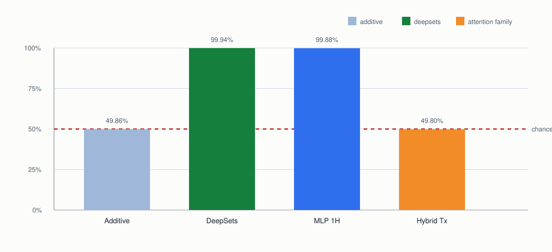
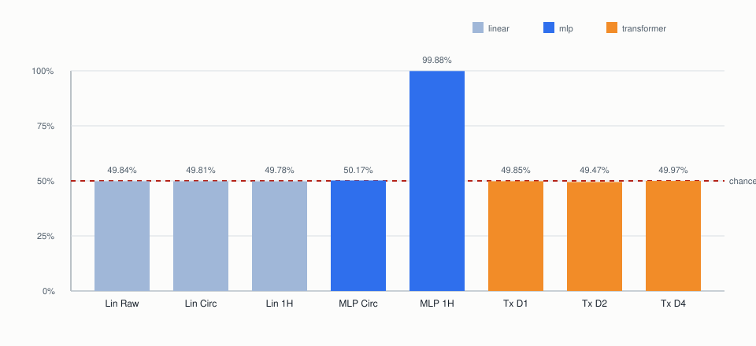
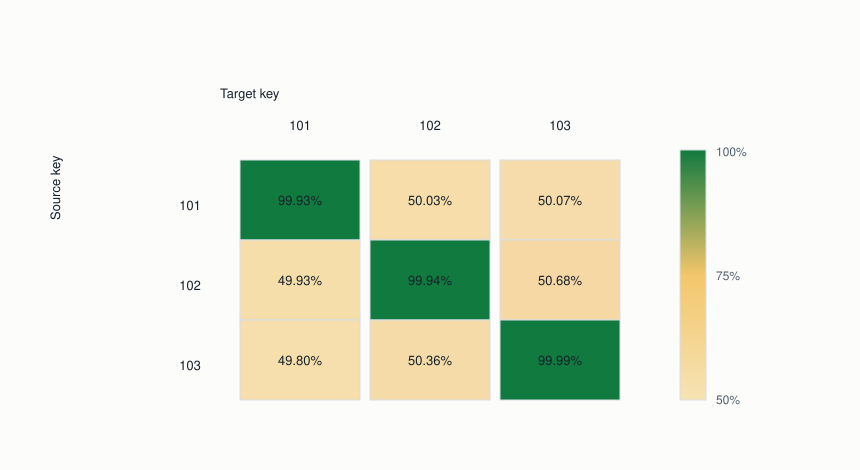
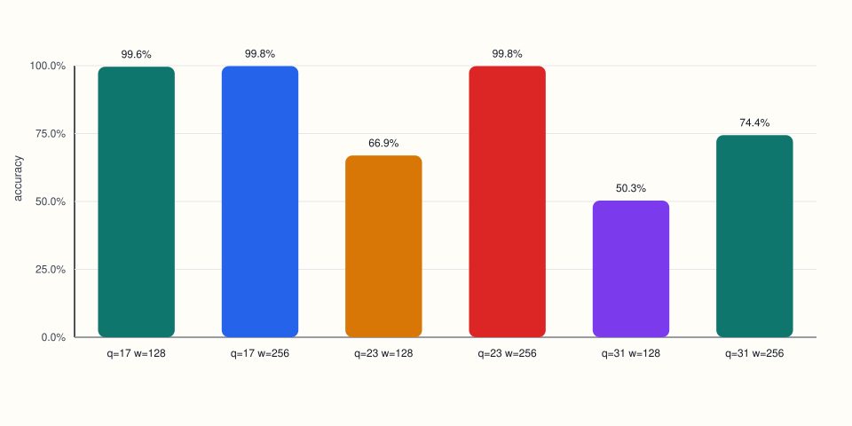
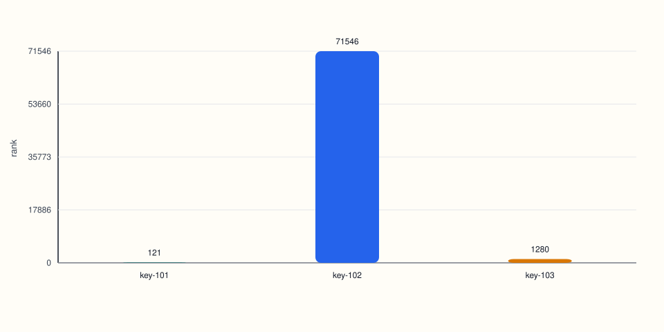
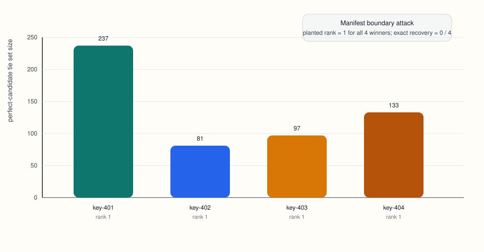
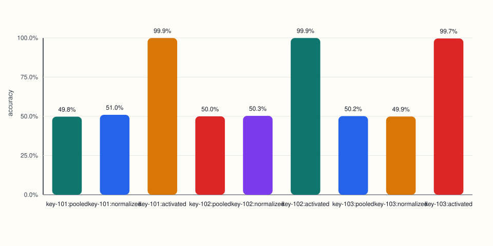

# Abstract

Can a small neural network learn to decrypt for one fixed secret key just from examples, and if it can, what exactly leaks once the model works? We study this question in a controlled Learning With Errors (LWE)-style benchmark where the key, public matrix, and encryption rule are fixed, the data are clean, and the only learning problem is to map ciphertexts back to the hidden bit. The benchmark is deliberately narrow. We are not testing broad cryptographic competence. We are testing whether a model can internalize one keyed modular circuit.

The answer is yes, but only for the right circuit family. In our main clean regime, `n=4, q=17`, small attention-based models fail, including tokenized decoder-style transformers, direct transformer classifiers, modulo-aware one-hot transformer classifiers, and a hybrid transformer with a learned modulo frontend. In contrast, a one-hot MLP and a DeepSets-style model with nonlinear local lifts followed by sum aggregation solve the task almost perfectly. An additive residue-table model fails, so the winner is not just a linear sum of per-residue lookups.

Once the task is solved, the leakage story is asymmetric. The winning DeepSets family is strongly key-bound: self-key accuracy is near-perfect while cross-key transfer collapses to chance. Black-box function stealing is delayed rather than instant: surrogates stay at chance through `20,000` random oracle queries, then jump to `99.9%` agreement at `200,000`. A stronger manifest-backed boundary attack consistently collapses the planted secret to rank `1`, but still leaves large ambiguity classes rather than a unique literal key. Inside a trained winner, the penultimate activated state exposes the latent decryptor almost linearly: simple probes recover the decryptor value $d = v - \langle s, u \rangle \bmod q$ and the output bit with about `99.5%-99.9%` accuracy. Across a zoo of independently trained winners, raw weights, fixed-query activation signatures, and fixed-query `d`-transcript signatures still do not yield usable literal secret recovery. Low-budget structured surrogate stealing also stays at chance, and a low-rank activated-state patch that can edit one secret does not retarget to a fresh unrelated key. Finally, the positive regime is narrow but not completely fragile: the winner remains near-saturated across moderate noise levels at `q=17`, while a small `q`/width boundary sweep shows that wider DeepSets models fully rescue `q=23` but only partially rescue `q=31`.

Taken together, these results point to a cleaner conclusion than the original “transformers hiding keys” story. Fixed-key modular decryption is learnable, but success is architecture-dependent, the winning computation is closer to a nonlinear additive set circuit than to small attention, and capability leakage plus late-state leakage are much easier than literal secret extraction.

# 1. Introduction

This paper starts from a simple question with nontrivial implications: if we hand a model many examples of encrypted integers and the correct hidden bit, can it learn to act like a decryptor for one fixed secret key?

That question sits at the intersection of a few different instincts. One instinct is mechanistic: what circuit family is naturally matched to modular arithmetic with a fixed secret? Another is security-flavored: if a model learns such a keyed computation, does the literal key become easy to recover, or does leakage show up in a softer form first? A third is practical: does a stock small transformer pick this up automatically, or does the algebra demand a different inductive bias?

We study the smallest version of that problem that still produces meaningful model and extraction behavior. We generate one small LWE-style instance, keep the secret key and public matrix fixed, sample many fresh ciphertexts from that instance, and train different model families to predict the hidden bit from ciphertext coordinates alone. The model never sees the planted key directly. It only sees example pairs.

This is not a proposal for a secure cryptographic primitive. It is a benchmark for learnability and extractability of keyed modular computation. That difference matters. We are not asking whether a model can replace public-key cryptography in the wild. We are asking what kind of neural circuit, if any, can internalize one fixed-key modular decryptor, and what traces of that keyed computation remain accessible after training.

The resulting picture is sharp:

- Clean fixed-key modular decryption is learnable at `n=4, q=17, sigma=0`.
- The winning family is not small attention. It is a nonlinear local-lift plus sum-aggregation circuit.
- The learned solution is strongly key-specific.
- Leakage is asymmetric: late internal states expose decryptor-equivalent information more readily than literal key recovery.
- The whole phenomenon is brittle; a modest move in modulus already changes the picture.

For a non-specialist, the simplest summary is this: some small neural nets can indeed learn a secret-bound decryptor, but the successful model here looks more like a structured arithmetic circuit than like a small attention model. And once it works, the easiest thing to steal is not necessarily the exact key, but the model's ability to behave like the decryptor.

The paper proceeds in four moves. Section 4 establishes the learnability result and the architecture split. Section 5 maps the leakage hierarchy once a winner exists. Section 6 adds compact controls on generalization, editability, and robustness. Sections 7 through 9 then interpret the resulting picture.

## 1.1 Contributions

Our main contributions are:

- We define and validate a clean fixed-key LWE-style benchmark where the planted secret is uniquely perfect and the labels are noise-free in the main regime.
- We identify a sharp architecture split: DeepSets-style and one-hot MLP models solve clean `n=4`, while multiple small attention families fail even with modulo-aware inputs.
- We show that the winning DeepSets family is genuinely key-bound: self-key accuracy averages `99.95%`, while cross-key transfer averages `50.15%`.
- We map several leakage channels on the winning family. Boundary attacks can collapse the planted secret to a rank-`1` ambiguity class, but literal secret recovery remains negative under simple white-box cross-model probes and under low-budget surrogate stealing.
- We show that the winner is editable but not easily re-keyable in the tested low-rank form: a local secret edit can work strongly, while cross-key retargeting stays at chance.
- We add compact controls showing that the winner transfers across fresh public matrices at fixed secret and tolerates moderate noise at `q=17`, even though width still only partially rescues `q=31`.

# 2. Task and Benchmark

## 2.1 Fixed-Key Learning Problem

We use a tiny Regev-style LWE regime. Each instance specifies:

- a public matrix `A`
- a secret vector `s`
- a public vector `b`
- per-example encryption randomness `r`

For a given bit $\beta \in \{0,1\}$, encryption samples $r \in \{0,1\}^m$ and computes

$$
u = A^T r \pmod q, \qquad
v = \langle b, r \rangle + \beta \cdot \lfloor q/2 \rfloor \pmod q.
$$

Decryption then computes

$$
d = v - \langle s, u \rangle \pmod q,
$$

and outputs

$$
\mathrm{Dec}_s(u, v) =
\begin{cases}
1 & \text{if } q/4 < d < 3q/4, \\
0 & \text{otherwise.}
\end{cases}
$$

The learning target is therefore the fixed-instance map

$$
\beta = \mathrm{Dec}_s(u, v).
$$

The model sees only ciphertext coordinates and the target bit. It does not see the planted secret `s`. Our central question is whether a neural circuit can infer and implement this keyed map from examples alone.

## 2.2 Main Regime

The main regime in the paper is:

- `n = 4`
- `m = 32`
- `q = 17`
- `sigma = 0`

with dataset sizes:

- `200,000` train
- `20,000` validation
- `40,000` test

We focus on this setting because it is the first clean regime that produced a nontrivial separation between model families. Easier settings exist, but they do not carry the same diagnostic value.

## 2.3 Sanity Checks

Before interpreting model behavior, we validated the benchmark itself.

In the clean `n=4, q=17, sigma=0` regime:

- scheme verification shows `0 / 5000` decryption failures
- brute-force search over all `17^4 = 83,521` candidate secrets recovers the planted secret as the unique perfect key
- the planted-key margin structure is perfectly separated on held-out data

These checks rule out the most uninteresting failure modes:

- the dataset is not corrupted
- the labels are not ambiguous
- the planted secret is not one of many equally good secrets

So when a model fails in this regime, the failure belongs to the model family, the representation, or the optimization setup rather than to the data pipeline.

# 3. Models and Protocol

We trained several model families to predict the target bit directly from ciphertext coordinates.

## 3.1 Families We Compare

**Linear and MLP baselines**

- linear models on raw, centered, circular, and one-hot modulo views
- small MLPs on the same feature families

**Attention families**

- tokenized causal transformer
- direct numeric transformer classifier
- token classifier transformer
- modulo-aware transformer classifier over one-hot residues
- hybrid modulo transformer with a learned local frontend before attention

**Circuit-style families**

- additive residue-table model
- DeepSets modulo classifier with nonlinear per-coordinate lift and sum pooling

## 3.2 Why These Families

The comparison is designed to answer three different questions.

First, is the task simply a linear classifier in disguise? Second, if attention fails, is the problem just tokenization or objective mismatch? Third, if a non-attention model wins, what is the minimal computational pattern that seems to match the decryptor?

That last question ended up mattering most. The winning model family is not just “the one that happened to train.” It reflects the underlying structure of the task.

## 3.3 Core Comparison

Table 1 anchors the main architecture result on clean `n=4, q=17, sigma=0`.

\begin{table}[t]
\centering
\small
{\setlength{\tabcolsep}{4pt}
\begin{tabular}{p{0.21\linewidth} p{0.18\linewidth} p{0.18\linewidth} r r r}
\hline
Family & Representation & Aggregator & Params & Best val & Test \\
\hline
Additive modulo classifier & Per-coordinate residues & Additive tables & 86 & 50.45\% & 49.86\% \\
DeepSets modulo classifier & Per-coordinate one-hot residues & Nonlinear lift + sum & 64,257 & 99.95\% & 99.94\% \\
One-hot MLP & Flattened one-hot residues & MLP & 27,649 & 99.87\% & 99.88\% \\
Transformer modulo depth 4 & Per-coordinate one-hot residues & Attention & 796,657 & 50.22\% & 49.97\% \\
Hybrid modulo transformer & One-hot residues + local lift & Attention & 445,185 & 50.51\% & 49.80\% \\
\hline
\end{tabular}
}
\caption{Core architecture comparison on clean $n=4, q=17, \sigma=0$.}
\end{table}

# 4. Learnability: The Architecture Split

## 4.1 Which Family Actually Solves the Task?

The first result that matters is not the transformer failure. It is the identity of the winner.

{ width=95% }

On clean `n=4`:

- additive residue tables stay at chance
- a DeepSets-style model solves the task
- a one-hot MLP also solves the task
- the hybrid modulo transformer remains flat

This pins down the successful computation family more clearly than a generic “neural nets can do it” headline would. Pure additive tables are too weak, so the solution is not just a linear sum of per-residue scores. But a nonlinear local lift followed by sum aggregation works almost perfectly. That is much closer to a small categorical arithmetic circuit than to content-based routing.

## 4.2 Small Attention Remains the Wrong Bias

We then asked whether the negative transformer result was just a bad input representation. The answer stayed negative.

{ width=95% }

Across tokenized, numeric, modulo-aware, and hybrid-front-end variants, the tested small attention models remained at chance on the same clean `n=4` task. The hybrid result is especially informative: even after giving attention a learned modulo-aware frontend, the model still failed.

The important point is not that we found one bad transformer configuration. It is that the gap survived several increasingly charitable formulations. In this regime, small attention appears to be the wrong inductive bias for the decryptor.

## 4.3 The Winning Solution Is Key-Bound

A model that solves the task could still be exploiting generic regularities of the clean regime rather than learning something meaningfully keyed. To test that, we trained the winning DeepSets family on three independently generated clean `n=4` keys and cross-evaluated every model on every key.

{ width=90% }

The result is decisive:

- mean self-key accuracy: `99.95%`
- mean cross-key accuracy: `50.15%`

Each model solves its own key almost perfectly and collapses to chance on other keys. The winner is therefore not merely regime-aware. It is genuinely key-bound.

## 4.4 The Positive Regime Is Narrow, Not Broad

The clean `n=4, q=17` success is real, but it is not broad modular competence.

We ran a compact boundary sweep holding `n=4`, `m=32`, and `sigma=0` fixed while varying only the modulus `q` and DeepSets width.

{ width=95% }

The sweep shows:

- `q=17`, width `128`: `99.61%`
- `q=17`, width `256`: `99.85%`
- `q=23`, width `128`: `66.94%`
- `q=23`, width `256`: `99.85%`
- `q=31`, width `128`: `50.33%`
- `q=31`, width `256`: `74.43%`

All three settings verified cleanly with `0 / 5000` scheme failures. So this is not a data-quality cliff. It is a learnability cliff. More width fully rescues `q=23`, but only partially rescues `q=31`. The positive region is therefore narrow and architecture-sensitive rather than smooth and generic.

# 5. Leakage Hierarchy

Once a model solves the task, the next question is not whether anything leaks, but which kind of leakage appears first.

Table 2 summarizes the asymmetry we found.

\begin{table}[t]
\centering
\small
{\setlength{\tabcolsep}{4pt}
\begin{tabular}{p{0.23\linewidth} p{0.17\linewidth} p{0.13\linewidth} p{0.25\linewidth}}
\hline
Attack family & Access & Budget & Main outcome \\
\hline
Random-query function stealing & Black-box oracle & 200 to 200,000 queries & Flat through 20,000; near-perfect surrogate at 200,000 \\
Structured low-budget stealing & Structured black-box oracle & 68 to 255 queries & Random and structured surrogates both stay at chance \\
Boundary-manifest sweep & Structured black-box oracle & 68 queries + candidate search & Planted rank 1 on 4 / 4 winners, but 0 / 4 exact recovery \\
Within-model activation probes & White-box activations & Linear / MLP probes & Penultimate state linearly exposes $\beta$ and $d$ \\
Weight-to-secret probe zoo & Raw weights & 28 checkpoints from 7 models & Weak coordinate signal, 0\% exact secret recovery \\
Cross-model activation-signature zoo & Fixed-query white-box signatures & 68 shared queries & 0\% exact secret recovery; `d` transcript still negative \\
\hline
\end{tabular}
}
\caption{Leakage channels on the winning clean $n=4$ DeepSets family.}
\end{table}

## 5.1 Black-Box Capability Theft Is Delayed, Not Instant

We first ran the most operational extraction attack: black-box function stealing. We queried a trained DeepSets winner on fresh ciphertexts, relabeled those ciphertexts with the winner's predictions, and trained surrogate DeepSets models on those oracle-labeled pairs.

{ width=95% }

The frontier is not a uniformly leaky small-budget curve.

- `200` queries: `50.23%` true test, `50.27%` oracle agreement
- `2,000` queries: `49.68%`, `49.74%`
- `20,000` queries: `50.44%`, `50.49%`
- `200,000` queries: `99.91%`, `99.92%`

So black-box capability theft is real, but it is not trivially cheap in this regime. The curve looks threshold-shaped rather than smoothly leaky.

## 5.2 Boundary Attacks Constrain The Secret Without Uniquely Recovering It

We then moved from random imitation to structure-aware querying. The early chosen-query families already showed that exact recovery was not trivially cheap on the first three winners.

The weaker basis-window sweep used `68` queries and exactly recovered `0 / 3` keys. Planted-secret ranks were:

- key `101`: `481`
- key `102`: `53,702`
- key `103`: `8,288`

The stronger binary-mask sweep used `255` queries and still exactly recovered `0 / 3` keys. Planted-secret ranks improved for some checkpoints:

- key `101`: `121`
- key `102`: `71,546`
- key `103`: `1,280`

The best case recovered `3 / 4` secret coordinates for one key, but not the full key. So even structure-aware exact recovery is not trivially cheap here.

{ width=90% }

We then ran the stronger manifest-backed boundary attack on fresh winners. That result sharpened the story considerably. Across four fresh DeepSets winners, the planted secret reached rank `1` every time, but exact recovery still failed in every case because many candidate secrets tied perfectly on the queried transcript. The tied perfect-candidate sets had sizes `237`, `81`, `97`, and `133`.

{ width=90% }

So the right summary is no longer just “chosen queries are weak.” It is more specific:

- structured black-box querying can collapse the planted key to a narrow ambiguity class
- but that ambiguity class does not collapse to a unique literal secret in the tested regime

That distinction matters. The positive extraction result is real, but it is a rank-collapse result rather than an exact-secret recovery result.

## 5.3 The Penultimate State Almost Linearly Exposes the Decryptor

The strongest leakage result is internal rather than external.

We probed three internal states of the winning DeepSets family on three independently trained keys:

- `pooled`
- `normalized`
- `activated` (the penultimate state before the final classifier)

For each state, we trained probes for:

- the output bit `beta`
- the latent decryptor class $d = v - \langle s, u \rangle \bmod q$
- the teacher logit

The pattern is clean.

Earlier states are not linearly transparent. Linear probes on `pooled` and `normalized` stay near chance for `beta` and `d`. But a tiny MLP already decodes `d` very well there, often above `97%`, which suggests the decryptor signal is present but not yet linearly organized.

At the penultimate `activated` state, the picture changes sharply:

- linear probe for `beta`: about `99.5%-99.9%`
- linear probe for `d`: about `99.7%-99.9%`
- linear regression to teacher logit: $R^2 \approx 0.998-0.9997$

{ width=95% }

This is the most revealing asymmetry in the paper. The literal secret does not trivially fall out of the model, but the model's late internal state is already behaving like an almost explicit decrypted representation.

## 5.4 Literal Secret Recovery Still Looks Harder Than Capability or State Leakage

To test whether the literal key was hiding in a reusable cross-model signature, we trained a small zoo of DeepSets winners:

- `12` attempted keys
- `7` converged winners
- `28` checkpoint samples across early, mid, and final training

We then ran two meta-extraction probes.

**Weight-to-secret extraction.** A probe trained on raw checkpoint weights stayed weak at every stage:

- coordinate accuracy: `12.5%`
- exact secret accuracy: `0%`

for epochs `5`, `10`, and final checkpoints alike.

**Activation-to-secret extraction across models.** Using a fixed shared query set of `68` inputs across the zoo, secret readout remained poor:

- `pooled`: `0%` coordinate, `0%` exact
- `normalized`: `12.5%` coordinate, `0%` exact
- `activated`: `0%` coordinate, `0%` exact

**Activation-to-`d`-transcript extraction across models.** Reusing the same fixed shared query set and replacing the target with the per-query decryptor transcript also stayed negative:

- `pooled`: `0.0%` transcript-position accuracy, `0%` exact transcript
- `normalized`: `1.47%` transcript-position accuracy, `0%` exact transcript
- `activated`: `1.47%` transcript-position accuracy, `0%` exact transcript

**Low-budget surrogate stealing with structured queries.** The last obvious bridge between black-box ambiguity collapse and white-box negative extraction also stayed weak. At `68` and `255` chosen queries, both random-query and structured-query surrogates stayed near chance:

- random `68`: `49.89%` true test, `49.80%` oracle agreement
- structured `68`: `50.36%`, `50.37%`
- random `255`: `49.38%`, `49.34%`
- structured `255`: `49.58%`, `49.67%`

This does not prove that secret extraction is impossible. It does show that the easiest leakage channel we found is not “read the secret straight out of the weights.” What leaks first is the ability to emulate the decryptor and, inside a single trained model, a late representation that already looks almost decrypted.

# 6. Compact Controls On The Winner

The core learnability and leakage results leave three obvious interpretation questions. Is the winning circuit tied to one sampled public matrix, or does it implement a reusable same-secret rule? Is the learned computation locally editable, or only globally replaceable? And is the positive regime narrow because it requires exactly zero noise, or because scale changes the task qualitatively?

The following compact controls answer those questions without turning the paper into a second project.

## 6.1 Same-Secret Transfer Across Fresh Public Matrices

To separate “learned decryptor” from “memorized one-matrix manifold,” we held the secret fixed, resampled the public matrix `A`, and evaluated a winner trained on one sampled `A` against two fresh held-out draws.

The result stayed essentially unchanged:

- train-distribution test: `99.86%`
- held-out `A_1`: `99.87%`
- held-out `A_2`: `99.86%`

This does not turn the paper into a many-instance generalization claim. It does rule out the simplest overfit story. At fixed secret and distributional family, the winner transfers almost perfectly across fresh public matrices.

## 6.2 Local Editability Does Not Imply Re-Keyability

The intervention results are similarly asymmetric. A rank-`16` activated-state patch can retarget a solved winner to a nearby one-coordinate secret edit at `93.83%` edited-label test accuracy, but the patch behaves as a hard retarget and drops original-label accuracy to `51.18%`.

That local success does not extend to fresh unrelated keys. The same low-rank patch path stays at chance for cross-key retargeting even with substantial target-key supervision:

- `100` examples: `49.77%`
- `1,000` examples: `49.72%`
- `10,000` examples: `49.86%`
- `100,000` examples: `50.12%`

So the winner is editable in a local sense, but not easily re-keyable in the tested low-rank form.

## 6.3 Moderate Noise Is Tolerated; Larger Modulus Remains The Real Boundary

The narrowness of the positive regime also has structure. At fixed `q=17` and width `256`, a compact sigma ladder stayed near-saturated:

- `sigma = 0.10`: `99.85%`
- `sigma = 0.25`: `99.88%`
- `sigma = 0.50`: `99.87%`

Combined with the earlier `q`/width sweep, this sharpens the interpretation. The main regime is narrow, but not because the winner only works at exactly `sigma = 0`. Moderate noise is tolerated at small modulus. The more serious boundary in the current benchmark is modulus growth, where width fully rescues `q=23` but only partially rescues `q=31`.

# 7. Discussion

## 7.1 What The Paper Shows

The most faithful summary is not “transformers can hide keys in weights.” That framing is too vague and, for this benchmark, largely misses the point.

What the paper shows is narrower and better:

- a neural model can learn a fixed-key modular decryptor in a clean nontrivial regime
- the right inductive bias matters a lot
- the winning computation looks like nonlinear local lifts plus additive set aggregation
- the learned solution is strongly tied to the training key
- leakage is asymmetric across attack surfaces
- that asymmetry includes a specific black-box/white-box split:
  - manifest-backed boundary attacks collapse the key to a rank-`1` ambiguity class
  - literal cross-model secret and transcript recovery still fail
  - low-budget capability cloning still fails

That asymmetry is the core result. Black-box stealing is delayed. Boundary attacks collapse the key to an ambiguity class rather than a literal secret. Raw weights do not suddenly reveal the secret. But the penultimate state of a winning model already exposes a decryptor-equivalent representation almost linearly.

## 7.2 What The Paper Does Not Show

This is not evidence for a secure software vault. The benchmark is tiny, fixed-key, and deliberately controlled. The positive regime is narrow. We do not claim that a model has learned general lattice cryptography, nor that the secret becomes permanently hidden just because exact secret recovery is not immediate.

We also do not claim that attention can never work. We claim something narrower and empirically grounded: in the small attention families and training setups we tested, attention was mismatched, while structured additive-set circuits fit the task naturally.

We also do not claim that editability implies re-keyability. In the tested low-rank intervention path, local secret editing worked, but cross-key retargeting did not.

## 7.3 Why The Leakage Story Matters

The most interesting outcome is that different notions of “recovery” separate:

- copying the function is possible, but not at tiny query budgets
- collapsing the secret to a narrow ambiguity class is easier than exact literal recovery
- probing the internal computation of one trained winner exposes decryptor state more easily than literal secret structure across many winners

That makes the benchmark useful even under a narrower framing. The right question is not whether a model can become a perfect hidden-key box. It is what form of leakage appears first once a keyed circuit is learned.

# 8. Limitations

This work is intentionally narrow.

- The strongest positive results live in tiny clean regimes.
- The attention comparison is broad enough to be meaningful, but not exhaustive.
- Our chosen-query attacks show ambiguity-class collapse, but they are still not full cryptanalysis.
- The weight and activation meta-extraction results are negative only for the probes we tried.
- The positive same-secret fresh-`A` transfer result does not by itself turn this into a many-instance generalization paper.
- The local key-edit result and the negative cross-key retargeting result are both specific to the tested low-rank intervention path.
- A side shared-trunk plus tiny keyed-adapter factorization probe also stayed weak; we keep it in Appendix A.6 rather than in the main paper arc.

Two follow-on questions now look most natural. One is causal: decode the penultimate decryptor subspace, ablate it, and measure how the classifier collapses. The other is comparative: turn the leakage ordering in this benchmark into a dedicated follow-on paper about what leaks first and what remains stubbornly hard.

# 9. Conclusion

We asked whether neural circuits can learn fixed-key modular decryption, which architectures succeed, and what becomes extractable once they do.

Our answer is:

- yes, fixed-key modular decryption is learnable
- no, the tested small attention family is not the natural winner
- yes, the learned solution can be strongly key-bound
- and no, leakage does not reduce to one simple story

In our benchmark, the winning family is a nonlinear additive set circuit. Capability theft is possible but delayed. Boundary attacks can collapse the secret to a narrow ambiguity class without uniquely recovering it. The penultimate state of a trained winner almost linearly exposes the decryptor itself. Raw weights and fixed-query cross-model signatures, by contrast, are far less cooperative.

That is a more interesting result than the original transformer-centric story. It suggests that the real science lives in the gap between learning a keyed function, emulating that function, and extracting the literal secret.

# Appendix A. Main Numerical Results

## A.1 Clean n=4, q=17 Core Models

| Model | Params | Best val | Test |
| --- | ---: | ---: | ---: |
| Additive modulo | 86 | 50.45% | 49.86% |
| DeepSets modulo | 64,257 | 99.95% | 99.94% |
| One-hot MLP | 27,649 | 99.87% | 99.88% |
| Modulo transf. d1 | 216,865 | 50.41% | 49.85% |
| Modulo transf. d2 | 410,129 | 50.45% | 49.47% |
| Modulo transf. d4 | 796,657 | 50.22% | 49.97% |
| Hybrid transf. | 445,185 | 50.51% | 49.80% |

## A.2 Key-Specificity Matrix

| Src / Tgt | key 101 | key 102 | key 103 |
| --- | ---: | ---: | ---: |
| key 101 | 99.93% | 50.03% | 50.07% |
| key 102 | 49.93% | 99.94% | 50.68% |
| key 103 | 49.80% | 50.36% | 99.99% |

## A.3 Leakage Summary

| Attack | Budget | Best outcome |
| --- | --- | --- |
| Random stealing | `200` | `50.23%` test, `50.27%` agr. |
| Random stealing | `2,000` | `49.68%`, `49.74%` |
| Random stealing | `20,000` | `50.44%`, `50.49%` |
| Random stealing | `200,000` | `99.91%`, `99.92%` |
| Basis-window queries | `68` | `0 / 3` exact recoveries |
| Binary-mask queries | `255` | `0 / 3` exact recoveries |
| Boundary-manifest sweep | `68` + local candidates | `4 / 4` planted rank `1`, `0 / 4` exact |
| Weight probe zoo | `28` ckpts | `12.5%` coord., `0%` exact |
| Activation probe zoo | `68` shared | `0-12.5%` coord., `0%` exact |
| `d`-transcript probe zoo | `68` shared | `0.0-1.47%` transcript pos., `0%` exact |
| Structured stealing | `68-255` | `49.58-50.36%` test, `49.67-50.37%` agr. |

## A.4 q / Width Boundary Sweep

| q | Width | Test | Best val |
| --- | ---: | ---: | ---: |
| 17 | 128 | 99.61% | 99.62% |
| 17 | 256 | 99.85% | 99.90% |
| 23 | 128 | 66.94% | 67.19% |
| 23 | 256 | 99.85% | 99.76% |
| 31 | 128 | 50.33% | 50.22% |
| 31 | 256 | 74.43% | 74.13% |

## A.5 Noise, Generalization, And Editability Controls

| Control | Setting | Main outcome |
| --- | --- | --- |
| Sigma ladder | `q=17`, width `256`, `sigma=0.10/0.25/0.50` | `99.85-99.88%` test |
| Same-secret fresh-`A` transfer | held-out `A_1`, `A_2` | `99.87%`, `99.86%` |
| Local key edit patch | rank `16`, one-coordinate secret edit | `93.83%` edited-label test, `51.18%` original-label test |
| Activated patch retargeting | rank `16`, `100` to `100,000` target examples | stays at chance |

## A.6 Shared Trunk + Tiny Keyed Adapter

We also tested a simple architectural split motivated by the idea that a shared reusable trunk might carry generic structure while a tiny adapter might carry the secret.

The result was weak.

A shared DeepSets trunk with adapter dimension `16`, trained jointly across three keys, reached:

- `66.59%` overall test accuracy with the learned adapters
- `55.30%` overall test accuracy when the adapter was zeroed out

Per-key results were highly uneven:

- key `101`: `99.67%`
- key `102`: `49.97%`
- key `103`: `50.15%`

So this naive “generic trunk plus tiny secret patch” factorization did not cleanly solve the task. The secret-bearing computation does not obviously collapse into a reusable trunk plus a cheap keyed add-on, at least in this first version.
