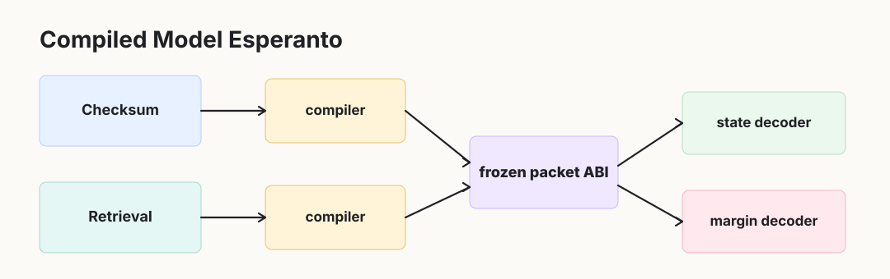
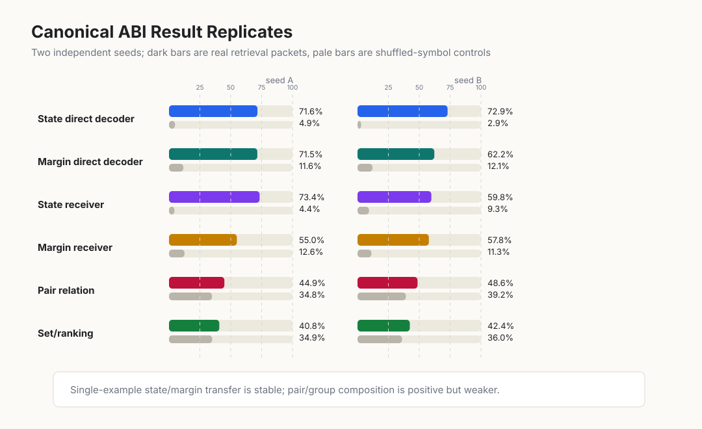
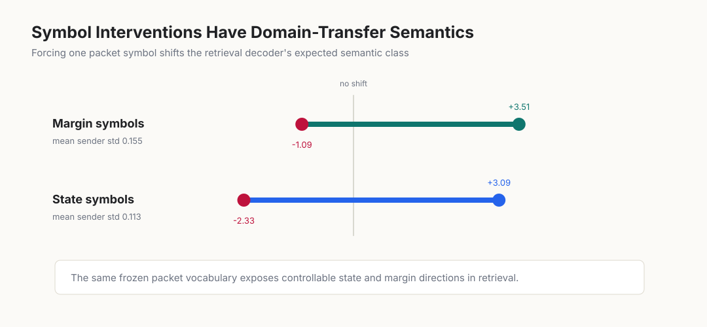
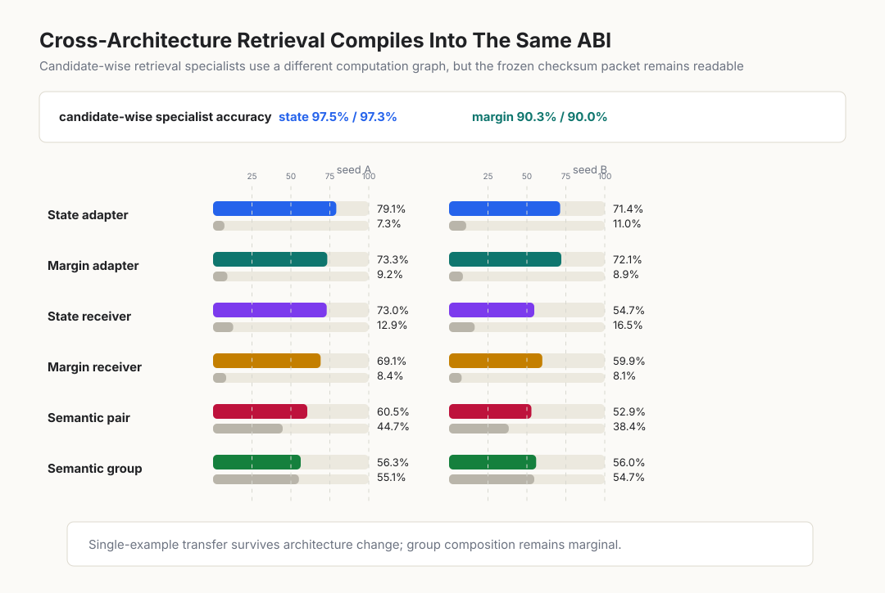
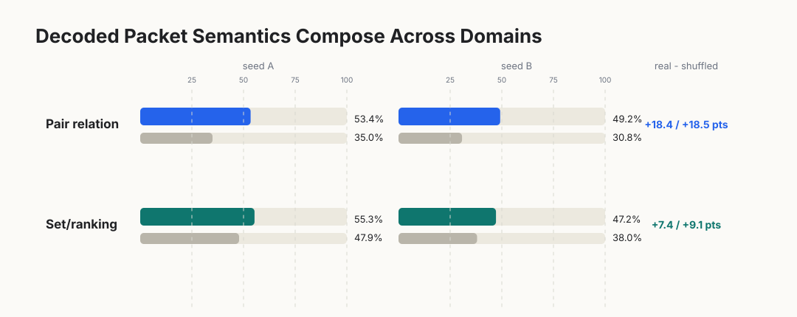

# Abstract

When neural specialists are connected into larger systems, they usually communicate through human-facing artifacts: text, JSON, tool calls, logits, or full hidden-state dumps. Each interface loses something. Text is expressive but bulky. Logits are narrow. Raw hidden states are model-native, but coordinate-private: a vector that means one thing inside one model may mean nothing inside another.

This paper asks whether there is a usable middle object: a small latent packet interface that is native enough to carry internal semantics, but stable enough that other models can learn to use it. The answer is not spontaneous Esperanto. Independently trained models do not expose a shared language for free. But compatible specialists can be compiled into one.

We train a frozen discrete packet ABI on modular checksum specialists, then introduce retrieval/ranking specialists from a different domain. Retrieval models are not allowed to change the language. They only learn small sender-local compilers into the frozen packet space. The message is tiny: two discrete choices from a 32-symbol vocabulary, or 10 bits of symbolic bandwidth.

The checksum-trained ABI transfers. Frozen checksum decoders recover retrieval state and confidence/margin far above shuffled-symbol controls in two independent runs; a different candidate-wise retrieval architecture also compiles into the same ABI. Symbol interventions move decoded semantics in stable directions. Pair and set/ranking composition transfer above shuffled controls, but remain less robust than single-example state and margin.

Taken together, these results support a concrete claim: a frozen latent ABI can preserve state and confidence semantics across held-out senders, domains, and architectures after local compilation. This is not spontaneous Esperanto. It is a reusable interface.

# 1. Introduction

Modern model systems talk through interfaces built for us. They emit text, call tools, exchange JSON, pass logits, or expose raw hidden states. These are useful engineering surfaces, but they are not a satisfying latent communication layer. Text is human-readable but high-bandwidth and indirect. Tool schemas are crisp but hand-designed. Logits compress a model down to a particular output vocabulary. Hidden states are model-native, but coordinate-private.

The missing object is a shared latent interface: small enough to be useful, semantic enough to be testable, and stable enough to survive model swaps.

There is an obvious fantasy version of this idea: train two models independently and hope they naturally speak the same hidden language. That is the wrong standard. Real interfaces do not work that way. CPUs do not naturally speak C; programs are compiled. Devices do not naturally speak a high-level API; they implement a protocol. The stable object is the interface contract, not the absence of adaptation.

This paper studies the compiled version of latent communication. We ask whether one family of neural specialists can define a frozen packet space, and whether specialists from another domain and architecture can later be compiled into that same packet space without retraining the language.

The working hypothesis is therefore compiled rather than spontaneous: models do not need to start with a shared latent language if they can learn small compilers into one.

We use controlled domains because known semantics make the interface falsifiable. A checksum specialist maps a discrete input to a state bucket and a margin/confidence bucket. A retrieval specialist sees a query and candidate set, then identifies the top candidate and the top1/top2 confidence gap. These tasks are different, but they share abstract variables: state/class, confidence, ambiguity, and ordering.

The test is deliberately hard. A checksum-trained ABI is frozen. Retrieval models do not retrain its decoders. They only learn a small compiler from their private hidden state into the packet. If frozen checksum decoders read retrieval packets, if symbol shuffles break the result, if symbol interventions have stable effects, and if a different retrieval architecture also compiles into the same packet space, then the packet is doing more than memorizing checksum labels.

## 1.1 Contributions

- We define a compiled latent-ABI test: a frozen packet space, frozen semantic decoders, sender-local compilers, and shuffled-symbol controls.
- We show that a checksum-trained 2 x 32 packet ABI transfers to retrieval/ranking specialists from another domain.
- We show that the same packet carries both state/class and margin/confidence semantics in the stricter multi-target setting.
- We show that packet symbols are not arbitrary labels: interventions on symbols produce large decoded semantic shifts.
- We show that the ABI survives a retrieval architecture change, not merely a new seed of the same model family.
- We show that packet semantics partially compose into pair and set/ranking tasks, while making clear that composition is not solved.

# 2. The Interface Is Compiled, Not Discovered

The central object is a frozen packet ABI. By ABI, we mean the packet format plus the frozen decoders attached to it. In the main experiments, one packet has two slots, each choosing one of 32 symbols. The whole message is therefore 10 bits.

We use the following terms throughout.

**State** is the discrete answer-like variable. In retrieval it is the top candidate bucket. In checksum it is the task's discrete state bucket.

**Margin** is the confidence/ambiguity variable. In retrieval it is a bucketed top1/top2 score gap. In checksum it is the bucketed distance-like confidence target.

**Packet** is the discrete message emitted by a sender: two codebook symbols.

**ABI** is the frozen packet space together with frozen state and margin decoders.

**Compiler** is a sender-local adapter from a specialist's private hidden state into the packet space.

**Receiver** is any downstream head trained to consume packets or decoded packet summaries.

The source family is a modular checksum task with q=19 and n=4. The held-out family is retrieval/ranking with 8 candidates. The nominal class chance levels are 12.5% for state, 16.7% for margin, 25% for the four-way pair relation, and 25% for the four-way group/ranking task. We report shuffled-symbol controls alongside these chance levels because packet shuffling preserves dataset priors and decoder biases while destroying symbol identity.

We interpret ABI transfer only after the sender specialist itself has learned. An initial generic retrieval MLP failed that gate, reaching only 36.7% state and 44.9% margin. The retained dot-product retrieval specialists reach about 96%-97% state accuracy and 88%-92% margin accuracy before ABI compilation. The candidate-wise architecture introduced later reaches about 97% state and 90% margin. The ABI results below are therefore not artifacts of an unsolved sender.

{ width=100% }

# 3. A Checksum Packet Language Transfers to Retrieval

The lead experiment trains one checksum packet ABI with two frozen decoders: one for state and one for margin. Retrieval specialists are trained separately. After the checksum ABI is frozen, retrieval models learn only a local compiler into that packet space.

This is the key test. Retrieval models are not allowed to invent a new language. They must speak the checksum packet language well enough for frozen checksum decoders to understand them.

{ width=100% }

The checksum-trained decoders read retrieval packets far above shuffled-symbol controls in two independent runs:

| Target | Seed A retrieval packet | Seed A shuffled | Seed B retrieval packet | Seed B shuffled |
|---|---:|---:|---:|---:|
| state | 71.6% | 4.9% | 72.9% | 2.9% |
| margin | 71.5% | 11.6% | 62.2% | 12.1% |

Checksum-trained receiver heads also transfer, with the same above-control pattern. The strongest reading is simple: the packet is not just a checksum-specific code. A retrieval model, seeing a different input distribution and solving a different rule family, can compile its private state into the same packet format. Frozen decoders trained on checksum packets recover retrieval state and confidence semantics.

Separate per-target ABIs give a useful upper bound. When margin and state are each given their own packet, retrieval transfer rises to 84%-94% under frozen decoders. Those runs are less strict because the packet is no longer shared across both targets, but they show that the domain transfer itself is robust. The multi-target packet is harder and more interesting.

# 4. Symbol Interventions Expose Semantics

Accuracy is not enough. A packet could help a receiver without its symbols having stable semantic effects. We therefore intervene directly on packet symbols.

For each slot and symbol, we force that symbol into retrieval packets and measure how the frozen decoder's expected class changes. If the codebook is only an arbitrary lookup table, this intervention map should be unstable or meaningless. Instead, selected symbols move decoded state and margin in large, repeatable directions.

{ width=92% }

In the canonical multi-target run, retrieval-side interventions shift expected decoded classes by multiple buckets:

| Target | Largest positive shift | Largest negative shift | Mean sender std |
|---|---:|---:|---:|
| margin | +3.511 | -1.095 | 0.155 |
| state | +3.086 | -2.327 | 0.113 |

The replication preserves the same structure:

| Target | Largest positive shift | Largest negative shift | Mean sender std |
|---|---:|---:|---:|
| margin | +3.290 | -1.227 | 0.043 |
| state | +2.384 | -2.874 | 0.053 |

This is the most language-like part of the result. Symbol identity is not decoration. Changing a symbol causes predictable semantic movement under frozen decoders, and the strongest effects are stable across held-out retrieval senders.

# 5. The ABI Survives an Architecture Change

The cross-domain result could still be a dot-product artifact. Perhaps that retrieval trunk exposes a state that is unusually easy to compile, while the packet would fail for a different computation graph.

We therefore train a candidate-wise retrieval specialist. Instead of one shared dot-product trunk, it uses candidate-local query/candidate/product/score features, candidate ID embeddings, a candidate-local MLP, and weighted/mean/max pooling. The task and labels stay the same. The checksum ABI stays frozen. The new retrieval model again gets only a local compiler into the packet.

\newpage

{ width=100% }

The candidate-wise specialists learn the retrieval task strongly: state 97.5% / 97.3% and margin 90.3% / 90.0% across two seeds. After local compilation into the same checksum ABI, frozen decoders recover:

| Target | Seed A retrieval packet | Seed A shuffled | Seed B retrieval packet | Seed B shuffled |
|---|---:|---:|---:|---:|
| state | 79.1% | 7.3% | 71.4% | 11.0% |
| margin | 73.3% | 9.2% | 72.1% | 8.9% |

Checksum-trained receiver heads also remain above controls. Seed A reaches 73.0% state and 69.1% margin, versus 12.9% and 8.4% shuffled. Seed B is weaker but still positive: 54.7% state and 59.9% margin, versus 16.5% and 8.1% shuffled.

This rules out the easiest private-geometry explanation. The ABI is not merely cross-domain; it is also not tied to one retrieval architecture's internal coordinates.

# 6. Packets Partially Compose

A packet language should eventually support more than one-example classification. We test two simple composition tasks. The pair task is a four-way relation over two examples, combining whether their states match and which has larger margin. The group task is a four-way "which item is most confident?" decision over four examples. Both have nominal 25% chance.

Composition is the hardest test in the paper, and this packet only partially passes it. The useful distinction is semantic transfer versus semantic algebra: single-example state and margin semantics transfer much more cleanly than relation and group behavior.

We get the clearest bridge by composing decoded packet semantics rather than raw packet bits. A checksum-side head is trained on frozen decoder summaries: state probabilities, margin probabilities, normalized expected state, normalized expected margin, and confidence terms. It is then evaluated on retrieval-side decoded summaries.

{ width=95% }

The composition heads transfer above shuffled controls:

| Task | Seed A retrieval | Seed A shuffled | Seed B retrieval | Seed B shuffled |
|---|---:|---:|---:|---:|
| pair relation | 53.4% | 35.0% | 49.2% | 30.8% |
| set/ranking | 55.3% | 47.9% | 47.2% | 38.0% |

Pair composition is the cleaner result. Set/ranking is positive in the canonical semantic-composition runs, but it is less robust in the cross-architecture setting, where group transfer is essentially marginal. The packet behaves like a reusable semantic interface before it behaves like a full compositional language.

# 7. Interpretation

The results separate four possibilities.

First, this is not source-domain memorization. Retrieval is not checksum, yet frozen checksum decoders read retrieval packets far above shuffled controls.

Second, this is not just one architecture's private geometry. A candidate-wise retrieval model with a different computation graph compiles into the same packet ABI.

Third, this is not an arbitrary continuous bottleneck with decorative symbol names. Symbol interventions move decoded semantics in consistent directions.

Fourth, this is a compiled interface, not full natural language. The packet needs a local compiler, and composition is incomplete. That makes the claim more practical: compatible specialists can be compiled into a frozen latent interface.

This is why the ABI framing matters. A zero-shot hidden Esperanto would be surprising but brittle. A frozen packet language with small local compilers is a more realistic object: reusable, testable, and concrete enough to measure.

# 8. Related Work

Emergent communication studies learned messages between agents, usually within a game or task family. Andreas, Dragan, and Klein's "Translating Neuralese" frames message meaning through the beliefs and actions induced in a listener, which is close in spirit to our receiver-transfer and intervention tests. Our setting is smaller, but the semantics are directly supervised and the controls are stricter: frozen decoders, held-out domains, symbol shuffles, and architecture changes.

Model stitching and representation alignment ask whether independently trained networks can be functionally connected or geometrically aligned. Recent work by Smith, Mannering, and Marcu warns that functional stitching can succeed while joined models encode different information. The ABI test is designed around that warning. We do not count functional compatibility alone; the packet must carry known semantic variables and fail when symbol identity is destroyed.

Mechanistic interpretability motivates the demand for semantic grounding. A latent interface is only interesting if the packet can be tied to known internal variables or behavioral factors. The controlled checksum and retrieval domains make that possible without relying on post hoc verbal explanations.

# 9. Limitations

This is not zero-shot model language. New specialists need local compilers. That is the point of the paper, but it is also a real limitation.

The domains are controlled. Checksum and retrieval/ranking are useful because their latent variables are known; they are not natural language systems or production agents.

The packet is small but not proven minimal. Two 32-way symbols are deliberately low-bandwidth, but the rate-distortion frontier is still unmapped.

Composition is partial. Pair relations transfer more cleanly than set/ranking behavior, and group composition is the main weak spot for this ABI.

The architecture result uses one additional retrieval family, not a broad architecture zoo. It rules out a dot-product-only explanation, but it does not settle architecture universality.

# 10. Conclusion

We introduced a controlled test for compiled latent communication. A checksum-trained 2 x 32 packet ABI is frozen, and held-out retrieval specialists from another domain and architecture are asked to compile into it using only local adapters.

They can. Frozen checksum decoders recover retrieval state and confidence semantics, shuffled-symbol controls break the result, symbol interventions have stable semantic effects, and a candidate-wise retrieval architecture also compiles into the same packet language. Relational composition appears but remains incomplete.

The result is not that models naturally share a universal hidden language. They do not start by speaking Esperanto; the evidence here is that they can be compiled into it.

# References

Jacob Andreas, Anca Dragan, and Dan Klein. 2017. Translating Neuralese. *Proceedings of the 55th Annual Meeting of the Association for Computational Linguistics*.

Damian Smith, Harvey Mannering, and Antonia Marcu. 2025. Functional Alignment Can Mislead: Examining Model Stitching. *Proceedings of the 42nd International Conference on Machine Learning*, PMLR 267:55972-55998.
